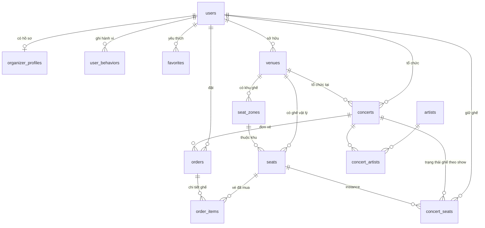

# CƠ SỞ DỮ LIỆU — CONCERT BOOKING SYSTEM

**Hệ quản trị:** PostgreSQL  
**ORM:** Django 6.0.4  
**User model:** `AUTH_USER_MODEL = 'users.User'`  
**Cập nhật:** 17/06/2026 — đồng bộ với schema thực tế trên PostgreSQL

Tài liệu mô tả **14 bảng nghiệp vụ** (không kể bảng hệ thống Django như `django_migrations`, `auth_group`, …).

---

## 1. Thống kê dữ liệu hiện tại

| Bảng | Số bản ghi | Ghi chú |
|------|------------|---------|
| `users` | 105 | Fan, organizer, admin |
| `organizer_profiles` | 1 | Hồ sơ nhà tổ chức (duyệt pending/approved/rejected) |
| `artists` | 100 | |
| `venues` | 50 | Có `model_glb_path` cho VR |
| `concerts` | 300 | Workflow status + organizer |
| `concert_artists` | 600 | ~2 nghệ sĩ/concert |
| `seat_zones` | 250 | ~5 zone/venue |
| `seats` | 44.436 | Tọa độ 2D/3D (pos_x, pos_y, pos_z) |
| `concert_seats` | 479.502 | Trạng thái ghế theo từng show |
| `vouchers` | 2 | Mã giảm giá active |
| `orders` | 406 | pending / paid / cancelled |
| `order_items` | 784 | ~1,9 ghế/đơn |
| `user_behaviors` | 508 | view, click, favorite |
| `favorites` | 200 | |

---

## 2. Sơ đồ quan hệ tổng thể (ERD)



---

## 3. Luồng dữ liệu nghiệp vụ chính

```
Venue (+ model_glb_path) ──► SeatZone ──► Seat (pos_x, pos_y, pos_z)
                │
Concert (status workflow) ◄── Venue
   │              ▲
   │              └── organizer_id (User)
   ├── ConcertArtist ◄── Artist
   │
   └── ConcertSeat (available → reserved → sold, reserved_by, reserved_until)
            │
User ──► Order (pricing breakdown + paypal_order_id) ──► OrderItem ──► Seat
         │
         └── voucher_code (snapshot text, không FK)
```

| Bước | Bảng liên quan | Mô tả |
|------|----------------|--------|
| 1 | `concerts`, `venues`, `concert_artists`, `organizer_profiles` | Fan xem show `published`; organizer quản lý draft → duyệt |
| 2 | `seat_zones`, `seats`, `concert_seats` | API seatmap; auto-sync ConcertSeat khi load |
| 3 | `concert_seats` | Reserve: `status=reserved`, `reserved_until`, `reserved_by` |
| 4 | `orders`, `order_items` | Tạo đơn `pending`, snapshot giá từng ghế |
| 5 | `orders`, `concert_seats` | PayPal capture OK → `paid`, ghế `sold` |
| 6 | `user_behaviors`, `favorites` | Ghi log để gợi ý cá nhân hóa |

---

## 4. Chi tiết từng bảng

### 4.1. `users` — Người dùng

Kế thừa `AbstractUser` của Django. Admin truy cập Django Admin qua `is_staff` / `is_superuser`.

| Cột | Kiểu | Ràng buộc | Mô tả |
|-----|------|-----------|--------|
| `id` | UUID | **PK** | |
| `username` | VARCHAR(150) | UNIQUE, NOT NULL | Username Django |
| `email` | VARCHAR(254) | UNIQUE, NOT NULL | Email đăng nhập |
| `password` | VARCHAR(128) | NOT NULL | Hash Django |
| `password_hash` | VARCHAR(255) | NOT NULL | Trường bổ sung |
| `full_name` | VARCHAR(255) | NOT NULL | Họ tên hiển thị |
| `avatar_url` | TEXT | NULL | URL ảnh đại diện |
| `role` | VARCHAR(10) | DEFAULT `'user'` | `user` \| `organizer` \| `admin` |
| `is_staff` | BOOLEAN | DEFAULT false | Django Admin |
| `is_superuser` | BOOLEAN | DEFAULT false | |
| `is_active` | BOOLEAN | DEFAULT true | |
| `last_login` | TIMESTAMPTZ | NULL | |
| `date_joined` | TIMESTAMPTZ | NOT NULL | |
| `created_at` | TIMESTAMPTZ | auto | |
| `updated_at` | TIMESTAMPTZ | auto | |

**Quan hệ:** → `orders`, `user_behaviors`, `favorites`, `owned_venues`, `organized_concerts`, `reserved_concert_seats`, `organizer_profile` (1-1)

**File:** `be/app/users/models.py`

---

### 4.2. `organizer_profiles` — Hồ sơ nhà tổ chức

| Cột | Kiểu | Ràng buộc | Mô tả |
|-----|------|-----------|--------|
| `id` | UUID | **PK** | |
| `user_id` | UUID | **FK → users**, CASCADE, UNIQUE | OneToOne |
| `company_name` | VARCHAR(255) | NOT NULL | Tên công ty |
| `business_license` | VARCHAR(100) | NOT NULL | Giấy phép KD |
| `contact_phone` | VARCHAR(20) | NOT NULL | SĐT liên hệ |
| `status` | VARCHAR(20) | DEFAULT `'pending'` | `pending` \| `approved` \| `rejected` |
| `reviewed_by_id` | UUID | **FK → users**, SET NULL | Admin duyệt |
| `reviewed_at` | TIMESTAMPTZ | NULL | |
| `rejection_reason` | TEXT | NOT NULL | Lý do từ chối |
| `created_at` | TIMESTAMPTZ | auto | |
| `updated_at` | TIMESTAMPTZ | auto | |

**File:** `be/app/users/models.py`

---

### 4.3. `artists` — Nghệ sĩ

| Cột | Kiểu | Ràng buộc | Mô tả |
|-----|------|-----------|--------|
| `id` | UUID | **PK** | |
| `name` | VARCHAR(255) | NOT NULL | |
| `genre` | VARCHAR(100) | NOT NULL | pop, kpop, rock, … |
| `description` | TEXT | NULL | |
| `image_url` | TEXT | NULL | |
| `created_at` | TIMESTAMPTZ | auto | |
| `updated_at` | TIMESTAMPTZ | auto | |

**Quan hệ:** N-N `concerts` qua `concert_artists`

---

### 4.4. `venues` — Địa điểm

| Cột | Kiểu | Ràng buộc | Mô tả |
|-----|------|-----------|--------|
| `id` | UUID | **PK** | |
| `name` | VARCHAR(255) | NOT NULL | |
| `city` | VARCHAR(100) | NOT NULL | Filter concert |
| `address` | TEXT | NOT NULL | |
| `capacity` | INTEGER | NOT NULL | |
| `organizer_id` | UUID | **FK → users**, SET NULL | Chủ venue (organizer) |
| `model_glb_path` | VARCHAR(500) | NOT NULL | Đường dẫn GLB/GLTF cho VR (vd: `models/venue_stage_1/scene.gltf`) |
| `created_at` | TIMESTAMPTZ | auto | |
| `updated_at` | TIMESTAMPTZ | auto | |

**Quan hệ:** → `concerts`, `seat_zones`, `seats`

---

### 4.5. `concerts` — Sự kiện

| Cột | Kiểu | Ràng buộc | Mô tả |
|-----|------|-----------|--------|
| `id` | UUID | **PK** | |
| `title` | VARCHAR(255) | NOT NULL | |
| `description` | TEXT | NULL | |
| `start_time` | TIMESTAMPTZ | NOT NULL | |
| `end_time` | TIMESTAMPTZ | NOT NULL | |
| `venue_id` | UUID | **FK → venues**, CASCADE | |
| `organizer_id` | UUID | **FK → users**, SET NULL | Nhà tổ chức |
| `status` | VARCHAR(20) | DEFAULT `'published'` | Xem mục 6 |
| `event_source` | VARCHAR(20) | DEFAULT `'internal'` | `internal` \| `external` |
| `banner_url` | TEXT | NULL | |
| `created_at` | TIMESTAMPTZ | auto | |
| `updated_at` | TIMESTAMPTZ | auto | |

**Workflow status:** `draft` → `pending_review` → `approved` / `rejected` → `published` → `cancelled` / `completed`

---

### 4.6. `concert_artists` — N-N concert ↔ artist

| Cột | Kiểu | Ràng buộc |
|-----|------|-----------|
| `id` | BIGINT | **PK** auto |
| `concert_id` | UUID | **FK → concerts**, CASCADE |
| `artist_id` | UUID | **FK → artists**, CASCADE |

**UNIQUE:** `(concert_id, artist_id)`

---

### 4.7. `seat_zones` — Khu ghế

| Cột | Kiểu | Ràng buộc | Mô tả |
|-----|------|-----------|--------|
| `id` | UUID | **PK** | |
| `venue_id` | UUID | **FK → venues**, CASCADE | |
| `name` | VARCHAR(100) | NOT NULL | VIP, A, B, Standard… |
| `price` | NUMERIC(10,2) | NOT NULL | Giá vé (VND) |
| `color` | VARCHAR(20) | NOT NULL | Hex cho UI |
| `created_at` | TIMESTAMPTZ | auto | |
| `updated_at` | TIMESTAMPTZ | auto | |

**UNIQUE:** `(venue_id, name)`

---

### 4.8. `seats` — Ghế vật lý (theo venue)

| Cột | Kiểu | Ràng buộc | Mô tả |
|-----|------|-----------|--------|
| `id` | UUID | **PK** | |
| `venue_id` | UUID | **FK → venues**, CASCADE | |
| `zone_id` | UUID | **FK → seat_zones**, CASCADE | |
| `row_label` | VARCHAR(5) | NOT NULL | A, B, C… |
| `seat_number` | INTEGER | NOT NULL | |
| `pos_x` | DOUBLE PRECISION | NOT NULL | Trục X (2D map / 3D scene) |
| `pos_y` | DOUBLE PRECISION | NOT NULL | Trục Z chiều sâu (3D) |
| `pos_z` | DOUBLE PRECISION | NOT NULL | Độ cao Y (từ GLTF import) |
| `created_at` | TIMESTAMPTZ | auto | |

**UNIQUE:** `(venue_id, row_label, seat_number)`

**Import GLTF:** `python manage.py import_seats_from_gltf` — đọc mesh ghế từ file GLB/GLTF venue.

---

### 4.9. `concert_seats` — Trạng thái ghế theo concert

| Cột | Kiểu | Ràng buộc | Mô tả |
|-----|------|-----------|--------|
| `id` | UUID | **PK** | |
| `concert_id` | UUID | **FK → concerts**, CASCADE | |
| `seat_id` | UUID | **FK → seats**, CASCADE | |
| `status` | VARCHAR(20) | DEFAULT `'available'` | `available` \| `reserved` \| `sold` |
| `reserved_until` | TIMESTAMPTZ | NULL | TTL giữ chỗ (10 phút) |
| `reserved_by_id` | UUID | **FK → users**, SET NULL | User đang giữ |
| `created_at` | TIMESTAMPTZ | auto | |
| `updated_at` | TIMESTAMPTZ | auto | |

**UNIQUE:** `(concert_id, seat_id)`

---

### 4.10. `vouchers` — Mã giảm giá

| Cột | Kiểu | Ràng buộc | Mô tả |
|-----|------|-----------|--------|
| `id` | UUID | **PK** | |
| `code` | VARCHAR(50) | UNIQUE | VD: DATN10 |
| `discount_percent` | NUMERIC(5,2) | NOT NULL | % giảm trên seat_subtotal |
| `description` | VARCHAR(255) | NOT NULL | |
| `is_active` | BOOLEAN | DEFAULT true | |
| `created_at` | TIMESTAMPTZ | auto | |

---

### 4.11. `orders` — Đơn đặt vé

| Cột | Kiểu | Ràng buộc | Mô tả |
|-----|------|-----------|--------|
| `id` | UUID | **PK** | |
| `user_id` | UUID | **FK → users**, CASCADE | |
| `concert_id` | UUID | **FK → concerts**, CASCADE | |
| `seat_subtotal` | NUMERIC(12,2) | DEFAULT 0 | Tổng tiền ghế |
| `booking_fee` | NUMERIC(10,2) | DEFAULT 0 | 20.000 ₫/đơn |
| `delivery_fee` | NUMERIC(10,2) | DEFAULT 0 | 30.000 ₫ nếu vé giấy |
| `insurance_fee` | NUMERIC(10,2) | DEFAULT 0 | 50.000 ₫ × số ghế |
| `discount_amount` | NUMERIC(10,2) | DEFAULT 0 | |
| `voucher_code` | VARCHAR(50) | NULL | Snapshot mã đã dùng |
| `delivery_method` | VARCHAR(20) | DEFAULT `'e_ticket'` | `e_ticket` \| `paper` |
| `has_insurance` | BOOLEAN | DEFAULT false | |
| `payment_method` | VARCHAR(30) | DEFAULT `'momo'` | Thực tế dùng `paypal` |
| `stripe_payment_intent_id` | VARCHAR(255) | NOT NULL | Dự phòng tích hợp Stripe |
| `paypal_order_id` | VARCHAR(255) | NOT NULL | ID đơn PayPal Sandbox |
| `total_price` | NUMERIC(12,2) | NOT NULL | |
| `status` | VARCHAR(20) | DEFAULT `'pending'` | `pending` \| `paid` \| `cancelled` |
| `created_at` | TIMESTAMPTZ | auto | |
| `updated_at` | TIMESTAMPTZ | auto | |

**Công thức:** `total = seat_subtotal + booking_fee + delivery_fee + insurance_fee - discount_amount`

---

### 4.12. `order_items` — Chi tiết ghế trong đơn

| Cột | Kiểu | Ràng buộc |
|-----|------|-----------|
| `id` | UUID | **PK** |
| `order_id` | UUID | **FK → orders**, CASCADE |
| `seat_id` | UUID | **FK → seats**, CASCADE |
| `price` | NUMERIC(10,2) | NOT NULL — snapshot giá zone |
| `created_at` | TIMESTAMPTZ | auto |

---

### 4.13. `user_behaviors` — Hành vi (gợi ý)

| Cột | Kiểu | Ràng buộc |
|-----|------|-----------|
| `id` | UUID | **PK** |
| `user_id` | UUID | **FK → users**, CASCADE |
| `concert_id` | UUID | **FK → concerts**, CASCADE |
| `action` | VARCHAR(20) | `view` \| `click` \| `favorite` |
| `created_at` | TIMESTAMPTZ | auto |

**Index:** `(user_id, created_at)`, `(concert_id, action)`

---

### 4.14. `favorites` — Yêu thích

| Cột | Kiểu | Ràng buộc |
|-----|------|-----------|
| `id` | BIGINT | **PK** auto |
| `user_id` | UUID | **FK → users**, CASCADE |
| `concert_id` | UUID | **FK → concerts**, CASCADE |
| `created_at` | TIMESTAMPTZ | auto |

**UNIQUE:** `(user_id, concert_id)`

---

## 5. Bảng tóm tắt Foreign Keys

| Bảng con | Cột FK | Bảng cha | ON DELETE |
|----------|--------|----------|-----------|
| `organizer_profiles` | `user_id` | `users` | CASCADE |
| `organizer_profiles` | `reviewed_by_id` | `users` | SET NULL |
| `venues` | `organizer_id` | `users` | SET NULL |
| `concerts` | `venue_id` | `venues` | CASCADE |
| `concerts` | `organizer_id` | `users` | SET NULL |
| `concert_artists` | `concert_id`, `artist_id` | `concerts`, `artists` | CASCADE |
| `seat_zones` | `venue_id` | `venues` | CASCADE |
| `seats` | `venue_id`, `zone_id` | `venues`, `seat_zones` | CASCADE |
| `concert_seats` | `concert_id`, `seat_id` | `concerts`, `seats` | CASCADE |
| `concert_seats` | `reserved_by_id` | `users` | SET NULL |
| `orders` | `user_id`, `concert_id` | `users`, `concerts` | CASCADE |
| `order_items` | `order_id`, `seat_id` | `orders`, `seats` | CASCADE |
| `user_behaviors` | `user_id`, `concert_id` | `users`, `concerts` | CASCADE |
| `favorites` | `user_id`, `concert_id` | `users`, `concerts` | CASCADE |

---

## 6. ENUM / giá trị cho phép

| Bảng | Cột | Giá trị |
|------|-----|---------|
| `users` | `role` | `user`, `organizer`, `admin` |
| `organizer_profiles` | `status` | `pending`, `approved`, `rejected` |
| `concerts` | `status` | `draft`, `pending_review`, `approved`, `rejected`, `published`, `cancelled`, `completed` |
| `concerts` | `event_source` | `internal`, `external` |
| `concert_seats` | `status` | `available`, `reserved`, `sold` |
| `orders` | `status` | `pending`, `paid`, `cancelled` |
| `orders` | `delivery_method` | `e_ticket`, `paper` |
| `user_behaviors` | `action` | `view`, `click`, `favorite` |

---

## 7. Phân lớp theo module Django

```
app/users/          → users, organizer_profiles
app/artists/        → artists
app/venues/         → venues
app/concerts/       → concerts, concert_artists
app/seats/          → seat_zones, seats, concert_seats
app/orders/         → vouchers, orders, order_items
app/behaviors/      → user_behaviors, favorites
app/organizer/      → (không có model — API portal)
app/admin_panel/    → (không có model — API portal)
```

---

## 8. API ↔ bảng CSDL

| API | Bảng đọc/ghi |
|-----|--------------|
| `GET /api/concerts/concerts/` | `concerts`, `venues`, `concert_artists` |
| `GET /api/concerts/concerts/{id}/seatmap/` | `seat_zones`, `seats`, `concert_seats` (auto-sync) |
| `POST /api/seats/booking/reserve/` | `concert_seats` → reserved |
| `POST /api/orders/orders/` | `orders`, `order_items` |
| `POST /api/orders/orders/{id}/create_paypal_order/` | `orders` (paypal_order_id) |
| `POST /api/orders/orders/{id}/pay/` | `orders` → paid, `concert_seats` → sold |
| `GET /api/behaviors/recommend/` | `user_behaviors`, `concerts` |
| `GET/POST /api/users/me/favorites/` | `favorites` |
| `GET /api/organizer/dashboard/` | aggregate orders, concerts |
| `POST /api/admin/organizers/{id}/approve/` | `organizer_profiles`, `users` |

Swagger: `http://localhost:8000/api/docs/`

---

## 9. Ghi chú thiết kế

1. **Tách `seats` / `concert_seats`:** Layout ghế tái sử dụng cho nhiều show; trạng thái bán theo concert.
2. **`pos_x`, `pos_y`, `pos_z`:** Sơ đồ 2D web/mobile + scene 3D VR (Three.js); import từ GLTF mesh ghế.
3. **`voucher_code` trên order:** Snapshot text, không FK — bảo toàn lịch sử khi voucher bị vô hiệu.
4. **Pricing tách dòng:** Hiển thị minh bạch phí đặt chỗ, giao vé, bảo hiểm, giảm giá.
5. **PayPal:** Giá VND quy đổi USD (`PAYPAL_VND_PER_USD=25000`) khi gọi PayPal Sandbox API.
6. **PostgreSQL:** Cấu hình `POSTGRES_*` trong `be/config/settings.py`; DB mặc định `concert`.

---

## 10. Tham chiếu mã nguồn

| Nội dung | Đường dẫn |
|----------|-----------|
| Models | `be/app/*/models.py` |
| Migrations | `be/app/*/migrations/` |
| Pricing | `be/app/orders/pricing.py` |
| PayPal | `be/app/orders/payments.py` |
| Reserve | `be/app/seats/reservation.py` |
| GLTF import | `be/app/seats/gltf_import.py` |
| Seatmap | `be/app/concerts/views.py` |
