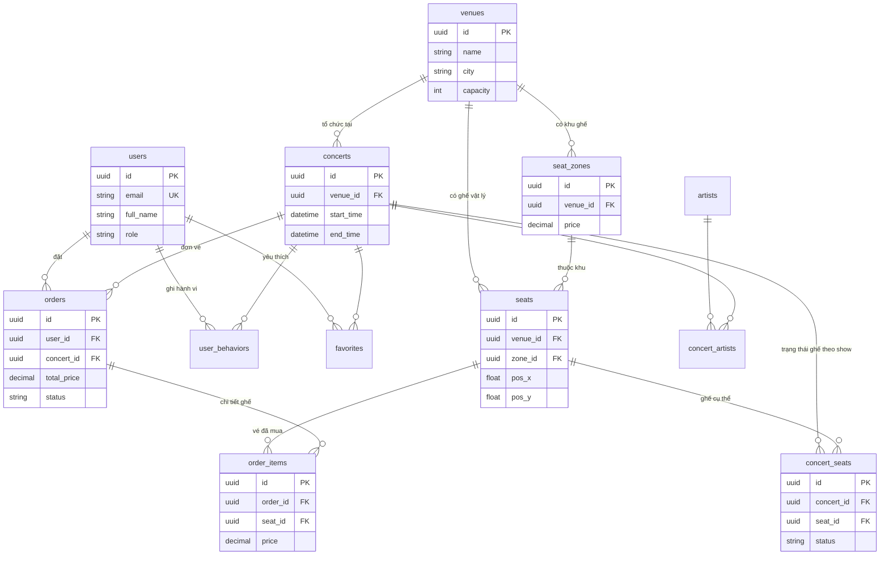

# CƠ SỞ DỮ LIỆU — CONCERT BOOKING SYSTEM

**Hệ quản trị:** PostgreSQL  
**ORM:** Django 6.x  
**User model:** `AUTH_USER_MODEL = 'users.User'`

Tài liệu mô tả **13 bảng nghiệp vụ** (không kể bảng hệ thống Django như `django_migrations`, `auth_group`, …).

---

## 1. Sơ đồ quan hệ tổng thể (ERD)



---

## 2. Luồng dữ liệu nghiệp vụ chính

```
Venue ──► SeatZone ──► Seat (pos_x, pos_y — dùng cho sơ đồ 2D/VR)
                │
Concert ◄── Venue
   │
   ├── ConcertArtist ◄── Artist
   │
   └── ConcertSeat (available → reserved → sold)
            │
User ──► Order ──► OrderItem ──► Seat
         │
         └── voucher_code (text, không FK trực tiếp tới bảng vouchers)
```

| Bước | Bảng liên quan | Mô tả |
|------|----------------|--------|
| 1 | `concerts`, `venues`, `concert_artists` | User xem thông tin show |
| 2 | `seat_zones`, `seats`, `concert_seats` | API seatmap trả zone + ghế + status |
| 3 | `concert_seats` | Reserve: `status = reserved`, set `reserved_until` |
| 4 | `orders`, `order_items` | Tạo đơn pending, gắn ghế + giá |
| 5 | `concert_seats` | Pay thành công: `status = sold` |
| 6 | `user_behaviors`, `favorites` | Ghi log view/click/favorite để gợi ý |

---

## 3. Chi tiết từng bảng

### 3.1. `users` — Người dùng

Kế thừa `AbstractUser` của Django (auth). Admin đăng nhập Django Admin qua `is_staff` / `is_superuser`.

| Cột | Kiểu | Ràng buộc | Mô tả |
|-----|------|-----------|--------|
| `id` | UUID | **PK** | Khóa chính |
| `username` | VARCHAR(150) | UNIQUE, NOT NULL | Username Django (auth) |
| `email` | VARCHAR(254) | UNIQUE, NOT NULL | Email đăng nhập |
| `password` | VARCHAR(128) | NOT NULL | Hash mật khẩu Django |
| `password_hash` | VARCHAR(255) | NOT NULL | Trường bổ sung (legacy/custom) |
| `full_name` | VARCHAR(255) | NOT NULL | Họ tên hiển thị |
| `avatar_url` | TEXT | NULL | URL ảnh đại diện |
| `role` | VARCHAR(10) | DEFAULT `'user'` | `'user'` \| `'admin'` |
| `first_name` | VARCHAR(150) | | Từ AbstractUser |
| `last_name` | VARCHAR(150) | | Từ AbstractUser |
| `is_staff` | BOOLEAN | DEFAULT false | Quyền vào Django Admin |
| `is_superuser` | BOOLEAN | DEFAULT false | Superuser |
| `is_active` | BOOLEAN | DEFAULT true | Tài khoản active |
| `last_login` | TIMESTAMP | NULL | Lần đăng nhập cuối |
| `date_joined` | TIMESTAMP | | Ngày tạo tài khoản |
| `created_at` | TIMESTAMP | auto | Thời điểm tạo record |
| `updated_at` | TIMESTAMP | auto | Thời điểm cập nhật |

**Quan hệ:**
- `users` → `orders` (1-N, `orders.user_id`)
- `users` → `user_behaviors` (1-N)
- `users` → `favorites` (1-N)
- `users` ↔ `auth_group`, `auth_permission` (M-N qua bảng trung gian Django)

**File model:** `be/app/users/models.py`

---

### 3.2. `artists` — Nghệ sĩ

| Cột | Kiểu | Ràng buộc | Mô tả |
|-----|------|-----------|--------|
| `id` | UUID | **PK** | |
| `name` | VARCHAR(255) | NOT NULL | Tên nghệ sĩ |
| `genre` | VARCHAR(100) | NOT NULL | Thể loại: pop, kpop, rock, … |
| `description` | TEXT | NULL | Mô tả |
| `image_url` | TEXT | NULL | Ảnh nghệ sĩ |
| `created_at` | TIMESTAMP | auto | |
| `updated_at` | TIMESTAMP | auto | |

**Quan hệ:**
- `artists` ↔ `concerts` qua bảng trung gian `concert_artists` (N-N)

**File model:** `be/app/artists/models.py`

---

### 3.3. `venues` — Địa điểm / Nhà hát

| Cột | Kiểu | Ràng buộc | Mô tả |
|-----|------|-----------|--------|
| `id` | UUID | **PK** | |
| `name` | VARCHAR(255) | NOT NULL | Tên venue |
| `city` | VARCHAR(100) | NOT NULL | Thành phố (filter concert) |
| `address` | TEXT | NOT NULL | Địa chỉ |
| `capacity` | INTEGER | NOT NULL | Sức chứa |
| `created_at` | TIMESTAMP | auto | |
| `updated_at` | TIMESTAMP | auto | |

**Quan hệ:**
- `venues` → `concerts` (1-N, `concerts.venue_id`)
- `venues` → `seat_zones` (1-N)
- `venues` → `seats` (1-N)

**File model:** `be/app/venues/models.py`

---

### 3.4. `concerts` — Sự kiện concert

| Cột | Kiểu | Ràng buộc | Mô tả |
|-----|------|-----------|--------|
| `id` | UUID | **PK** | |
| `title` | VARCHAR(255) | NOT NULL | Tên concert |
| `description` | TEXT | NULL | Mô tả |
| `start_time` | TIMESTAMP | NOT NULL | Giờ bắt đầu |
| `end_time` | TIMESTAMP | NOT NULL | Giờ kết thúc |
| `venue_id` | UUID | **FK → venues.id**, CASCADE | Địa điểm |
| `banner_url` | TEXT | NULL | Ảnh banner |
| `created_at` | TIMESTAMP | auto | |
| `updated_at` | TIMESTAMP | auto | |

**Quan hệ:**
- `concerts` → `concert_artists` (1-N)
- `concerts` → `concert_seats` (1-N)
- `concerts` → `orders` (1-N)
- `concerts` → `user_behaviors`, `favorites` (1-N)

**File model:** `be/app/concerts/models.py`

---

### 3.5. `concert_artists` — Nghệ sĩ tham gia concert (N-N)

| Cột | Kiểu | Ràng buộc | Mô tả |
|-----|------|-----------|--------|
| `id` | BIGINT | **PK** (auto) | Django tự sinh |
| `concert_id` | UUID | **FK → concerts.id**, CASCADE | |
| `artist_id` | UUID | **FK → artists.id**, CASCADE | |

**Ràng buộc:** `UNIQUE (concert_id, artist_id)` — một nghệ sĩ không lặp trong cùng concert.

**File model:** `be/app/concerts/models.py` — class `ConcertArtist`

---

### 3.6. `seat_zones` — Khu vực ghế (VIP, A, B, …)

| Cột | Kiểu | Ràng buộc | Mô tả |
|-----|------|-----------|--------|
| `id` | UUID | **PK** | |
| `venue_id` | UUID | **FK → venues.id**, CASCADE | Thuộc venue |
| `name` | VARCHAR(100) | NOT NULL | Tên khu: VIP, Standard, … |
| `price` | DECIMAL(10,2) | NOT NULL | Giá vé khu này |
| `color` | VARCHAR(20) | NOT NULL | Mã màu hex (UI seatmap) |
| `created_at` | TIMESTAMP | auto | |
| `updated_at` | TIMESTAMP | auto | |

**Ràng buộc:** `UNIQUE (venue_id, name)` — tên khu không trùng trong cùng venue.

**Quan hệ:**
- `seat_zones` → `seats` (1-N, `seats.zone_id`)

**File model:** `be/app/seats/models.py`

---

### 3.7. `seats` — Ghế vật lý (cố định theo venue)

| Cột | Kiểu | Ràng buộc | Mô tả |
|-----|------|-----------|--------|
| `id` | UUID | **PK** | |
| `venue_id` | UUID | **FK → venues.id**, CASCADE | |
| `zone_id` | UUID | **FK → seat_zones.id**, CASCADE | Khu ghế |
| `row_label` | VARCHAR(5) | NOT NULL | Hàng: A, B, C, … |
| `seat_number` | INTEGER | NOT NULL | Số ghế trong hàng |
| `pos_x` | FLOAT | NOT NULL | Tọa độ X trên sơ đồ 2D (VR/Web UI) |
| `pos_y` | FLOAT | NOT NULL | Tọa độ Y trên sơ đồ 2D |
| `created_at` | TIMESTAMP | auto | |

**Ràng buộc:** `UNIQUE (venue_id, row_label, seat_number)` — không trùng ghế trong venue.

**Quan hệ:**
- `seats` → `concert_seats` (1-N)
- `seats` → `order_items` (1-N)

**File model:** `be/app/seats/models.py`

---

### 3.8. `concert_seats` — Trạng thái ghế theo từng concert

Một ghế vật lý (`seats`) có thể dùng cho nhiều concert khác nhau tại cùng venue; trạng thái được lưu **theo từng show**.

| Cột | Kiểu | Ràng buộc | Mô tả |
|-----|------|-----------|--------|
| `id` | UUID | **PK** | |
| `concert_id` | UUID | **FK → concerts.id**, CASCADE | |
| `seat_id` | UUID | **FK → seats.id**, CASCADE | |
| `status` | VARCHAR(20) | DEFAULT `'available'` | `available` \| `reserved` \| `sold` |
| `reserved_until` | TIMESTAMP | NULL | Hết hạn giữ chỗ (timeout) |
| `created_at` | TIMESTAMP | auto | |
| `updated_at` | TIMESTAMP | auto | |

**Ràng buộc:** `UNIQUE (concert_id, seat_id)` — mỗi ghế chỉ một record/concert.

**File model:** `be/app/seats/models.py`

---

### 3.9. `vouchers` — Mã giảm giá

| Cột | Kiểu | Ràng buộc | Mô tả |
|-----|------|-----------|--------|
| `id` | UUID | **PK** | |
| `code` | VARCHAR(50) | UNIQUE, NOT NULL | VD: `DATN10`, `CONCERT20` |
| `discount_percent` | DECIMAL(5,2) | NOT NULL | % giảm |
| `description` | VARCHAR(255) | | Mô tả voucher |
| `is_active` | BOOLEAN | DEFAULT true | Còn hiệu lực |
| `created_at` | TIMESTAMP | auto | |

**Lưu ý:** `orders.voucher_code` lưu **chuỗi mã** đã áp dụng, **không có FK** trực tiếp tới `vouchers.id` (snapshot tại thời điểm đặt).

**File model:** `be/app/orders/models.py`

---

### 3.10. `orders` — Đơn đặt vé

| Cột | Kiểu | Ràng buộc | Mô tả |
|-----|------|-----------|--------|
| `id` | UUID | **PK** | |
| `user_id` | UUID | **FK → users.id**, CASCADE | Người đặt |
| `concert_id` | UUID | **FK → concerts.id**, CASCADE | Concert |
| `seat_subtotal` | DECIMAL(12,2) | DEFAULT 0 | Tổng tiền ghế |
| `booking_fee` | DECIMAL(10,2) | DEFAULT 0 | Phí đặt chỗ |
| `delivery_fee` | DECIMAL(10,2) | DEFAULT 0 | Phí giao vé giấy |
| `insurance_fee` | DECIMAL(10,2) | DEFAULT 0 | Phí bảo hiểm vé |
| `discount_amount` | DECIMAL(10,2) | DEFAULT 0 | Số tiền giảm |
| `voucher_code` | VARCHAR(50) | NULL | Mã voucher đã dùng |
| `delivery_method` | VARCHAR(20) | DEFAULT `'e_ticket'` | `e_ticket` \| `paper` |
| `has_insurance` | BOOLEAN | DEFAULT false | Có mua bảo hiểm |
| `payment_method` | VARCHAR(30) | DEFAULT `'momo'` | Cổng TT (mock) |
| `total_price` | DECIMAL(12,2) | NOT NULL | Tổng thanh toán |
| `status` | VARCHAR(20) | DEFAULT `'pending'` | `pending` \| `paid` \| `cancelled` |
| `created_at` | TIMESTAMP | auto | |
| `updated_at` | TIMESTAMP | auto | |

**Công thức pricing (logic app):**  
`total_price = seat_subtotal + booking_fee + delivery_fee + insurance_fee - discount_amount`

**Quan hệ:**
- `orders` → `order_items` (1-N)

**File model:** `be/app/orders/models.py` — logic tính giá: `be/app/orders/pricing.py`

---

### 3.11. `order_items` — Chi tiết ghế trong đơn

| Cột | Kiểu | Ràng buộc | Mô tả |
|-----|------|-----------|--------|
| `id` | UUID | **PK** | |
| `order_id` | UUID | **FK → orders.id**, CASCADE | |
| `seat_id` | UUID | **FK → seats.id**, CASCADE | Ghế đã mua |
| `price` | DECIMAL(10,2) | NOT NULL | Giá ghế tại thời điểm đặt |
| `created_at` | TIMESTAMP | auto | |

**File model:** `be/app/orders/models.py`

---

### 3.12. `user_behaviors` — Hành vi người dùng (gợi ý)

| Cột | Kiểu | Ràng buộc | Mô tả |
|-----|------|-----------|--------|
| `id` | UUID | **PK** | |
| `user_id` | UUID | **FK → users.id**, CASCADE | |
| `concert_id` | UUID | **FK → concerts.id**, CASCADE | |
| `action` | VARCHAR(20) | NOT NULL | `view` \| `click` \| `favorite` |
| `created_at` | TIMESTAMP | auto | |

**Index:**
- `(user_id, created_at)`
- `(concert_id, action)`

**File model:** `be/app/behaviors/models.py`

---

### 3.13. `favorites` — Concert yêu thích

| Cột | Kiểu | Ràng buộc | Mô tả |
|-----|------|-----------|--------|
| `id` | BIGINT | **PK** (auto) | |
| `user_id` | UUID | **FK → users.id**, CASCADE | |
| `concert_id` | UUID | **FK → concerts.id**, CASCADE | |
| `created_at` | TIMESTAMP | auto | |

**Ràng buộc:** `UNIQUE (user_id, concert_id)` — mỗi user chỉ favorite một lần/concert.

**File model:** `be/app/behaviors/models.py`

---

## 4. Bảng tóm tắt quan hệ (Foreign Keys)

| Bảng con | Cột FK | Bảng cha | ON DELETE |
|----------|--------|----------|-----------|
| `concerts` | `venue_id` | `venues` | CASCADE |
| `concert_artists` | `concert_id` | `concerts` | CASCADE |
| `concert_artists` | `artist_id` | `artists` | CASCADE |
| `seat_zones` | `venue_id` | `venues` | CASCADE |
| `seats` | `venue_id` | `venues` | CASCADE |
| `seats` | `zone_id` | `seat_zones` | CASCADE |
| `concert_seats` | `concert_id` | `concerts` | CASCADE |
| `concert_seats` | `seat_id` | `seats` | CASCADE |
| `orders` | `user_id` | `users` | CASCADE |
| `orders` | `concert_id` | `concerts` | CASCADE |
| `order_items` | `order_id` | `orders` | CASCADE |
| `order_items` | `seat_id` | `seats` | CASCADE |
| `user_behaviors` | `user_id` | `users` | CASCADE |
| `user_behaviors` | `concert_id` | `concerts` | CASCADE |
| `favorites` | `user_id` | `users` | CASCADE |
| `favorites` | `concert_id` | `concerts` | CASCADE |

---

## 5. Ràng buộc UNIQUE

| Bảng | Cột | Ý nghĩa |
|------|-----|---------|
| `users` | `email`, `username` | Không trùng tài khoản |
| `vouchers` | `code` | Mã voucher duy nhất |
| `seat_zones` | `(venue_id, name)` | Tên khu duy nhất/venue |
| `seats` | `(venue_id, row_label, seat_number)` | Ghế duy nhất/venue |
| `concert_seats` | `(concert_id, seat_id)` | Một ghế một trạng thái/show |
| `concert_artists` | `(concert_id, artist_id)` | Không lặp nghệ sĩ/show |
| `favorites` | `(user_id, concert_id)` | Favorite một lần |

---

## 6. ENUM / giá trị cho phép

| Bảng | Cột | Giá trị |
|------|-----|---------|
| `users` | `role` | `user`, `admin` |
| `concert_seats` | `status` | `available`, `reserved`, `sold` |
| `orders` | `status` | `pending`, `paid`, `cancelled` |
| `orders` | `delivery_method` | `e_ticket`, `paper` |
| `user_behaviors` | `action` | `view`, `click`, `favorite` |

---

## 7. Sơ đồ phân lớp theo module Django

```
app/users/          → users
app/artists/        → artists
app/venues/         → venues
app/concerts/       → concerts, concert_artists
app/seats/          → seat_zones, seats, concert_seats
app/orders/         → vouchers, orders, order_items
app/behaviors/      → user_behaviors, favorites
```

---

## 8. API liên quan trực tiếp tới DB

| API | Bảng đọc/ghi |
|-----|--------------|
| `GET /api/concerts/concerts/` | `concerts`, `venues`, `concert_artists` |
| `GET /api/concerts/concerts/{id}/seatmap/` | `seat_zones`, `seats`, `concert_seats` |
| `POST /api/seats/booking/reserve/` | `concert_seats` (→ reserved) |
| `POST /api/orders/orders/` | `orders`, `order_items` |
| `POST /api/orders/orders/{id}/pay/` | `orders`, `concert_seats` (→ sold) |
| `GET /api/behaviors/recommend/` | `user_behaviors`, `concerts` |
| `GET/POST favorites` | `favorites` |

Chi tiết API: `be/API_DOCUMENTATION.md`

---

## 9. Ghi chú thiết kế

1. **Tách `seats` và `concert_seats`:** Ghế vật lý gắn venue; trạng thái bán/giữ gắn từng concert — tái sử dụng layout cho nhiều show.
2. **`pos_x`, `pos_y`:** Phục vụ sơ đồ 2D web/mobile và client VR; API seatmap trả về qua `GET .../seatmap/`.
3. **`voucher_code` trên order:** Lưu snapshot, không FK — voucher có thể đổi/`is_active=false` sau này.
4. **Pricing tách dòng:** `seat_subtotal`, `booking_fee`, `delivery_fee`, `insurance_fee`, `discount_amount` hỗ trợ hiển thị minh bạch trên FE.
5. **PostgreSQL:** Cấu hình qua biến môi trường `POSTGRES_*` trong `be/config/settings.py`.

---

## 10. Tham chiếu mã nguồn

| Nội dung | Đường dẫn |
|----------|-----------|
| Models | `be/app/*/models.py` |
| Migrations | `be/app/*/migrations/` |
| Pricing | `be/app/orders/pricing.py` |
| Seatmap view | `be/app/concerts/views.py` → action `seatmap` |
| Reserve logic | `be/app/seats/views.py` |

---

*Tài liệu đồng bộ với schema Django tại thời điểm migration `0003_voucher_order_pricing_fields` (orders).*
