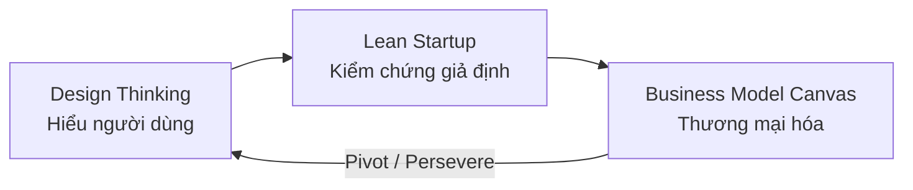
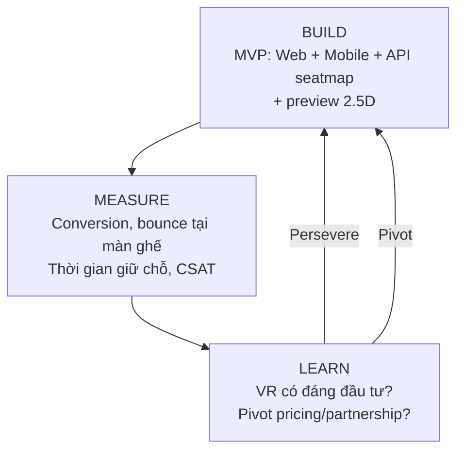
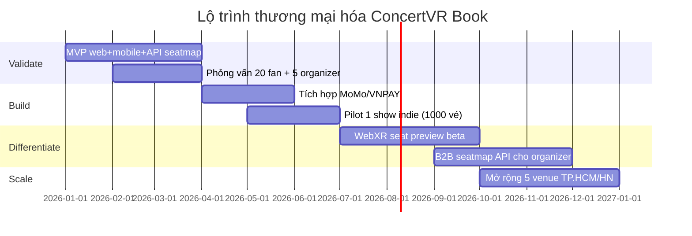

# ĐỊNH HƯỚNG KHỞI NGHIỆP VÀ THƯƠNG MẠI HÓA

**Dự án:** Xây dựng ứng dụng mua vé concert tích hợp công nghệ VR trải nghiệm sơ đồ không gian  
**Mã dự án:** DATN — Concert Booking System (ConcertGo)  
**Khung áp dụng:** Design Thinking · Lean Startup · Business Model Canvas (Osterwalder) · Lean Canvas (Ash Maurya)  
**Cập nhật trạng thái MVP:** 17/06/2026

---

## 1. Tổng quan: Ba khung bổ trợ lẫn nhau

Ba phương pháp không thay thế nhau mà **nối tiếp theo vòng đời sản phẩm**:

| Giai đoạn | Khung | Câu hỏi trung tâm |
|-----------|-------|-------------------|
| **Empathize → Define → Ideate** | **Design Thinking** | Người fan concert thực sự đau khổ điều gì khi mua vé? |
| **Prototype → Test → Iterate** | **Lean Startup** | Giả định nào đúng/sai? MVP nào đủ nhỏ để học nhanh? |
| **Mô hình hóa → Scale → Tối ưu** | **Business Model Canvas** | Kiếm tiền, phân phối và vận hành bền vững thế nào? |



**Tham chiếu lý thuyết:**
- Alexander Osterwalder & Yves Pigneur — *Business Model Generation* (2010): [Strategyzer BMC](https://www.strategyzer.com/canvas/business-model-canvas)
- Eric Ries — *The Lean Startup* (2011): vòng **Build → Measure → Learn**
- Steve Blank — *Customer Development*: “There are no facts inside the building”
- Ash Maurya — *Lean Canvas*: BMC tinh gọn cho startup giai đoạn sớm

---

## 2. Design Thinking cho ConcertVR Book

### 2.1. Empathize — Chân dung người dùng

| Persona | Đặc điểm | Nỗi đau (Pain) |
|---------|----------|----------------|
| **Fan Gen Z (18–28)** | Quen mobile, thích trải nghiệm số | Sơ đồ ghế phẳng khó hình dung tầm nhìn; sợ mua nhầm ghế kém |
| **Fan concert thường xuyên (25–40)** | So sánh giá nhiều kênh | Phí ẩn, giữ chỗ hết hạn nhanh, không biết view thực tế |
| **Nhà tổ chức (Organizer)** | Cần lấp đầy venue, giảm no-show | Kênh bán rời rạc, tỷ lệ bỏ giỏ cao ở bước chọn ghế |
| **Đối tác venue** | Quản lý zone/giá phức tạp | Thiếu công cụ preview 3D cho khách |

### 2.2. Define — Problem Statement

> **Fan concert tại Việt Nam** gặp khó khăn **hình dung vị trí ghế và trải nghiệm thực tế tại venue** khi **đặt vé trực tuyến**, dẫn đến **do dự lâu, chọn sai zone, hoặc bỏ giỏ** — trong khi **sơ đồ 2D truyền thống** (Ticketbox, Songkick…) **không truyền tải không gian và tầm nhìn sân khấu**.

### 2.3. Ideate — Giải pháp sáng tạo

| Ý tưởng | Mô tả | Ưu tiên |
|---------|--------|---------|
| **VR Seat Preview** | Người dùng “ngồi thử” ghế trong mô hình 3D venue trước khi mua | ★★★ |
| **Sơ đồ không gian 2.5D** | Web/mobile: layout sân khấu đa khu, zoom, màu trạng thái real-time | ★★★ (MVP hiện tại) |
| **Gợi ý zone thông minh** | Dựa hành vi + ngân sách → đề xuất khu ghế phù hợp | ★★ |
| **Giữ chỗ có hạn + pricing minh bạch** | Phí đặt chỗ, giao vé, bảo hiểm, voucher rõ ràng | ★★★ (đã có trong hệ thống) |

### 2.4. Prototype → Test (trong Design Thinking)

| Mức fidelity | Mô tả | Chi phí | Mục đích test |
|--------------|--------|---------|---------------|
| **Paper prototype** | Luồng chọn ghế trên giấy | Thấp | Hiểu mental model người dùng |
| **Figma clickable** | Mock VR toggle + seat map | Trung bình | Test UX trước khi code |
| **MVP phần mềm** | Web + API seatmap 2D + mobile Android | Trung bình | Đo conversion search → book |
| **VR MVP** | Three.js viewer + GLTF venue + tọa độ 3D ghế | Cao | Validate “VR có tăng tỷ lệ chốt vé?” — **đã có trên web** |

---

## 3. Lean Startup — Kiểm chứng trước khi scale

### 3.1. Giả định rủi ro cao (cần test sớm)

| # | Giả định | Cách kiểm chứng (Experiment) | Chỉ số đo |
|---|----------|------------------------------|-----------|
| H1 | Fan sẵn sàng dùng VR preview trước khi mua | A/B: có VR vs không VR trên 100 user | Tỷ lệ chốt vé, thời gian chọn ghế |
| H2 | Organizer trả phí white-label cho seatmap VR | Phỏng vấn 5 BTC venue + pilot 1 show | LOI / hợp đồng pilot |
| H3 | Phí dịch vụ 5–8% vẫn cạnh tranh | So sánh giá all-in với Ticketbox | Giá trung bình/đơn, NPS |
| H4 | API seatmap 2D đủ cho MVP trước VR | Ship web + mobile, đo funnel | Search → seat → checkout % |

### 3.2. Vòng Build — Measure — Learn



### 3.3. Lộ trình MVP (gắn mã nguồn DATN — cập nhật 17/06/2026)

| Giai đoạn | Phạm vi | Trạng thái dự án |
|-----------|--------|------------------|
| **MVP 1** | Auth, danh sách concert, seatmap 2D, giữ chỗ, checkout | ✅ Web + BE + Mobile |
| **MVP 2** | Gợi ý, voucher, pricing minh bạch, PayPal Sandbox | ✅ Hoàn thành |
| **MVP 2b** | Organizer portal, Admin portal web, workflow duyệt concert | ✅ Hoàn thành |
| **MVP 3** | Three.js VR preview (`/concerts/:id/vr-preview`), GLTF import ghế 3D (`pos_z`) | ✅ Web — WebXR nâng cao 🔜 |
| **MVP 4** | Cổng TT production (MoMo/VNPAY), push notification, iOS | 🔜 Ngoài phạm vi đồ án |

**Dữ liệu thực tế (PostgreSQL):** 300 concert · 50 venue · 44.436 ghế · 406 đơn hàng · 105 user.

> API seatmap trả `pos_x`, `pos_y`, `pos_z` + venue `model_glb_path` — client VR đã tích hợp trên **React/Three.js**. Mobile Android dùng seatmap 2D + PayPal browser flow.

### 3.4. Pivot vs Persevere — Quy tắc quyết định

| Tín hiệu **Persevere** (tiếp tục) | Tín hiệu **Pivot** (đổi hướng) |
|-----------------------------------|--------------------------------|
| Conversion màn ghế > 40% | Bounce > 60% tại seat selection |
| NPS ≥ 40 sau mua vé thử nghiệm | Organizer không trả phí B2B |
| VR tăng conversion ≥ 15% so với 2D | Chi phí phát triển VR > LTV khách |
| Repeat booking ≥ 20% trong 6 tháng | CAC > 30% giá trị đơn trung bình |

---

## 4. Business Model Canvas (BMC)

**Tên giả định thương hiệu:** *ConcertVR Book*  
**Định vị:** Nền tảng đặt vé concert với **trải nghiệm sơ đồ không gian VR/2.5D**, minh bạch giá, đa kênh web + mobile.

### 4.1. Sơ đồ 9 ô (Osterwalder)

```
┌─────────────────────┬─────────────────────┬─────────────────────┬─────────────────────┐
│  KEY PARTNERS       │  KEY ACTIVITIES     │  VALUE PROPOSITIONS │  CUSTOMER           │
│                     │                     │                     │  RELATIONSHIPS      │
│  • Nhà tổ chức /    │  • Phát triển       │  • Xem trước vị trí │  • Self-service     │
│    promoter concert │    nền tảng web/    │    ghế qua sơ đồ   │    (app/web)        │
│  • Venue / BTC      │    mobile + module  │    không gian VR    │  • CSKH chat/email  │
│  • Cổng thanh toán  │    VR               │  • Giữ chỗ real-    │  • Cộng đồng fan    │
│    (MoMo, VNPAY)    │  • Tích hợp API     │    time, giá rõ     │    (review, share)  │
│  • Cloud (AWS/GCP)  │    seatmap venue    │  • Gợi ý concert    │  • B2B: account     │
│  • Nghệ sĩ / label  │  • Marketing sự     │    cá nhân hóa      │    manager cho        │
│  • Đối tác VR       │    kiện             │  • Đặt vé đa kênh   │    organizer        │
│    (Meta, WebXR)    │  • Quản lý kho ghế  │    một tài khoản    │                     │
├─────────────────────┼─────────────────────┤                     ├─────────────────────┤
│  KEY RESOURCES      │                     │                     │  CHANNELS           │
│                     │                     │                     │                     │
│  • REST API + DB    │                     │                     │  • Website React    │
│  • Dữ liệu venue    │                     │                     │  • App Android/iOS  │
│    3D / seatmap     │                     │                     │  • QR tại venue     │
│  • Đội ngũ dev      │                     │                     │  • Social / KOL     │
│  • JWT + quy trình  │                     │                     │  • SEO concert      │
│    pricing          │                     │                     │  • API B2B embed    │
├─────────────────────┴─────────────────────┴─────────────────────┴─────────────────────┤
│  COST STRUCTURE                          │  REVENUE STREAMS                          │
│  • Cloud hosting + CDN                   │  • Phí dịch vụ trên giá vé (5–8%)         │
│  • Phí cổng thanh toán (~1–2%)           │  • Phí premium VR preview (tuỳ chọn)      │
│  • Lương dev / vận hành                  │  • Subscription B2B cho organizer         │
│  • Marketing sự kiện ra mắt              │  • Quảng cáo nghệ sĩ / sponsored listing  │
│  • Bản quyền / quét venue 3D             │  • Phí giao vé giấy / bảo hiểm vé          │
│  • R&D module VR                         │  • White-label seatmap API                │
└──────────────────────────────────────────┴───────────────────────────────────────────┘
```

### 4.2. Chi tiết từng khối BMC

#### (1) Phân khúc khách hàng (Customer Segments)

| Phân khúc | Nhu cầu | Ví dụ |
|-----------|---------|-------|
| **B2C — Fan concert** | Mua vé nhanh, đúng ghế, giá minh bạch | Sinh viên, nhân viên văn phòng TP.HCM/HN |
| **B2B — Organizer / Promoter** | Bán hết vé, giảm support “ghế này nhìn thấy gì?” | Công ty tổ chức liveshow, festival |
| **B2B2C — Venue** | Digital hóa sơ đồ ghế, giảm in ấn | Nhà hát, stadium, club |

#### (2) Giá trị cốt lõi (Value Propositions)

| Đối tượng | Giá trị | Khác biệt so với Ticketbox / đối thủ |
|-----------|---------|--------------------------------------|
| Fan | **“Ngồi thử ghế trước khi trả tiền”** — VR/3D preview | Sơ đồ 2D phẳng, không có spatial sense |
| Fan | Giá all-in: vé + phí + voucher + bảo hiểm | Phí ẩn, khó so sánh |
| Organizer | Seatmap API + analytics hành vi chọn ghế | Tool rời rạc, không gợi ý |
| Venue | Một lần scan 3D → dùng nhiều show | Mỗi show setup lại thủ công |

#### (3) Kênh phân phối (Channels)

1. **Web** (React/Vite) — SEO, desktop/mobile browser  
2. **Mobile app** (Android Kotlin) — fan thường xuyên  
3. **VR client** (WebXR / Meta Quest) — differentiation  
4. **B2B embed** — iframe seatmap cho website organizer  
5. **Social/KOL** — concert drop, flash sale  

#### (4) Quan hệ khách hàng (Customer Relationships)

- **Self-service:** đăng ký, chọn ghế, thanh toán tự động  
- **Automated:** email vé điện tử, nhắc thanh toán trước hết hạn giữ chỗ  
- **Personalized:** gợi ý concert (`behaviors` module)  
- **B2B dedicated:** account manager cho partner lớn  

#### (5) Dòng doanh thu (Revenue Streams)

| Nguồn | Mô hình | Ước tính (tham khảo thị trường vé online) |
|-------|---------|-------------------------------------------|
| **Phí dịch vụ** | % trên giá vé (commission) | 5–8% GMV — tương tự nền tảng vé quốc tế |
| **Phí VR premium** | Freemium: 2D miễn phí, VR trả phí/lần | 10.000–30.000đ/lần preview (giả định) |
| **B2B SaaS** | Gói tháng cho organizer | 2–5 triệu/tháng/show lớn |
| **Phụ phí** | Giao vé giấy, bảo hiểm, đổi vé | Đã model trong `orders/pricing.py` |
| **Quảng cáo** | Sponsored concert / banner nghệ sĩ | Theo CPC/CPM |

#### (6) Hoạt động chính (Key Activities)

- Phát triển & vận hành nền tảng (API Django, web, mobile, VR)  
- Thu thập / số hóa sơ đồ venue (photogrammetry, CAD, manual 2D→3D)  
- Tích hợp thanh toán, đối soát với organizer  
- Marketing theo từng concert (performance marketing)  
- Quản lý inventory ghế real-time (reserve → pay → sold)  

#### (7) Nguồn lực chính (Key Resources)

| Loại | Chi tiết |
|------|----------|
| **Kỹ thuật** | PostgreSQL, REST API, seatmap 2D (`pos_x`, `pos_y`), module pricing |
| **Dữ liệu** | Venue layout, lịch concert, lịch sử hành vi |
| **Con người** | Full-stack dev, 3D/VR artist, BD partnership |
| **Thương hiệu** | Uy tín thanh toán, review fan |

#### (8) Đối tác chính (Key Partners)

- **Organizer / nghệ sĩ** — nguồn vé chính thức  
- **Venue** — dữ liệu sơ đồ ghế, quy tắc zone  
- **MoMo / VNPAY / Stripe** — thanh toán  
- **Cloud provider** — scale peak khi mở bán vé hot  
- **Meta / Apple (Vision Pro)** — phân phối VR experience (tham khảo mô hình VR concert toàn cầu)  

#### (9) Cấu trúc chi phí (Cost Structure)

| Loại chi phí | Fixed / Variable | Ghi chú |
|--------------|------------------|---------|
| Lương dev & vận hành | Fixed | MVP: team nhỏ 2–4 người |
| Cloud + DB | Variable | Tăng mạnh khi flash sale |
| Phí payment gateway | Variable | ~1–2% GMV |
| Marketing concert | Variable | CAC theo từng show |
| Quét / mô hình hóa venue 3D | Fixed/show | Chi phí VR cao nhất |
| R&D WebXR | Fixed | Sau khi validate MVP 2D |

---

## 5. Value Proposition Canvas (bổ sung cho BMC)

```
┌──────────────────────────────┐     ┌──────────────────────────────┐
│      CUSTOMER PROFILE         │     │    VALUE PROPOSITION MAP     │
│                               │     │                              │
│  Jobs:                        │     │  Products & Services:        │
│  • Mua vé concert yêu thích   │     │  • App/web đặt vé            │
│  • Chọn ghế có view tốt       │     │  • VR / 2.5D seat preview    │
│  • Thanh toán an toàn         │     │  • API seatmap cho partner   │
│                               │     │                              │
│  Pains:                       │     │  Pain Relievers:             │
│  • Không hình dung view ghế   │────▶│  • Preview không gian trước  │
│  • Hết ghế / giữ chỗ ngắn      │     │  • Giữ chỗ có countdown      │
│  • Phí không rõ               │     │  • Breakdown giá minh bạch   │
│                               │     │                              │
│  Gains:                       │     │  Gain Creators:              │
│  • Cảm giác “như ở venue”     │────▶│  • VR immersion              │
│  • Gợi ý show phù hợp         │     │  • Recommendation engine     │
│  • Vé digital tiện lưu        │     │  • Vé điện tử + lịch sử đơn  │
└──────────────────────────────┘     └──────────────────────────────┘
```

---

## 6. Lean Canvas (phiên bản startup sớm)

| # | Khối | Nội dung — ConcertVR Book |
|---|------|---------------------------|
| 1 | **Problem** | Sơ đồ ghế 2D không đủ; fan chọn sai zone; organizer mất conversion ở bước seat |
| 2 | **Customer Segments** | Fan concert VN 18–35; organizer indie & mid-size |
| 3 | **Unique Value Proposition** | *“Thấy đúng chỗ ngồi — trước khi trả tiền”* với VR/spatial seatmap |
| 4 | **Solution** | Web + mobile booking + API seatmap + VR preview module |
| 5 | **Channels** | App store, web, social concert drops, B2B sales |
| 6 | **Revenue Streams** | Commission 5–8%, VR premium, B2B SaaS |
| 7 | **Cost Structure** | Dev, cloud, payment fee, 3D venue capture |
| 8 | **Key Metrics** | Conversion seat→checkout, GMV, CAC, repeat rate, VR adoption % |
| 9 | **Unfair Advantage** | Dữ liệu seatmap + hành vi chọn ghế tích lũy; quan hệ organizer sớm |

---

## 7. So sánh với thị trường & xu hướng VR concert

| Xu hướng | Thực tế thị trường | Áp dụng cho dự án |
|----------|-------------------|-------------------|
| VR concert **livestream** (Meta Quest, Vision Pro) | Người xem remote tham dự show ảo | Khác phân khúc — dự án tập trung **preview ghế** cho show thật |
| Nền tảng vé truyền thống | Ticketmaster, Ticketbox — sơ đồ 2D | Differentiation bằng **spatial UX** |
| Lean Startup trong VR/AR | MVP giả lập trước (video 360, WebXR demo) | Tránh đầu tư Unity full trước khi validate H1 |
| Thương mại hóa | Commission + premium experience + merch VR | Revenue đa dòng, không phụ thuộc 1 nguồn |

---

## 8. Kế hoạch thương mại hóa 12 tháng (gợi ý)



| Quý | Mục tiêu | KPI |
|-----|----------|-----|
| Q1 | Hoàn thiện MVP, test nội bộ | 50 user thử, bug < 10 critical |
| Q2 | Pilot 1 concert thật | 100 đơn, conversion seat > 30% |
| Q3 | VR beta + B2B pitch | 2 LOI organizer, VR adoption > 20% |
| Q4 | Mở rộng venue | GMV 500M+, repeat user > 15% |

---

## 9. Rủi ro & giảm thiểu

| Rủi ro | Mức | Giảm thiểu |
|--------|-----|------------|
| VR chi phí cao, ít user có headset | Cao | WebXR trên browser; 2.5D làm default |
| Organizer không chia sẻ data ghế | Cao | Bắt đầu show nhỏ/indie; tool tự nhập seatmap |
| Cạnh tranh nền tảng lớn | Trung bình | Niche: spatial UX + fan experience |
| Peak traffic khi mở bán | Trung bình | Reserve lock + queue (đã thiết kế BE) |
| Pháp lý bán vé | Trung bình | Hợp tác promoter có giấy phép |

---

## 10. Liên kết với hệ thống kỹ thuật DATN

| Khối BMC | Thành phần mã nguồn |
|----------|---------------------|
| Value Proposition (seatmap) | `GET /api/concerts/concerts/{id}/seatmap/` |
| Key Activities (reserve) | `POST /api/seats/booking/reserve/` |
| Revenue (pricing) | `be/app/orders/pricing.py` |
| Channels (web/mobile) | `FE/`, `mobile_app_concert/` |
| Customer Relationships (gợi ý) | `app/behaviors/` |
| Key Resources (admin) | Django Admin `/admin/` |

---

## 11. Tài liệu tham khảo

1. Osterwalder, A. & Pigneur, Y. (2010). *Business Model Generation*. Strategyzer.  
   https://www.strategyzer.com/canvas/business-model-canvas  
2. Ries, E. (2011). *The Lean Startup*. Crown Business.  
3. Blank, S. & Dorf, B. (2012). *The Startup Owner's Manual*.  
4. Maurya, A. *Running Lean* — Lean Canvas.  
   https://www.atlassian.com/software/confluence/templates/lean-canvas  
5. Pitt University — BMC & Lean Startups guide.  
   https://pitt.libguides.com/innovation/lean  
6. FasterCapital — Lean Startup in VR/AR.  
   https://fastercapital.com/content/Lean-Startup-in-VR-AR--How-to-Apply-the-Lean-Startup-Methodology-in-Virtual-Reality-and-Augmented-Reality.html  
7. Lean Case — Design Thinking + Lean + BMC integration.  
   https://www.lean-case.com/business-model-canvas-examples/  

---

## 12. Hướng dẫn đưa vào luận văn / Word

1. **Chương 1–2 (Cơ sở lý thuyết):** copy mục 1, 2, 3 (Design Thinking + Lean Startup).  
2. **Chương mô hình kinh doanh:** copy mục 4, 5, 6 — vẽ lại BMC 9 ô bằng **draw.io** hoặc **Canvanizer**.  
3. **Chương triển khai:** mục 8 (Gantt) + mục 10 (ánh xạ kỹ thuật).  
4. **Phụ lục:** Value Proposition Canvas, Lean Canvas, bảng giả định mục 3.1.  

> **Gợi ý hình vẽ:** Export sơ đồ mermaid tại [mermaid.live](https://mermaid.live) sang PNG cho Word.

---

*Tài liệu được xây dựng dựa trên khung BMC/Osterwalder, Lean Startup/Ries, Design Thinking và đặc thù dự án DATN Concert Booking System (web + mobile + API seatmap, định hướng VR).*
