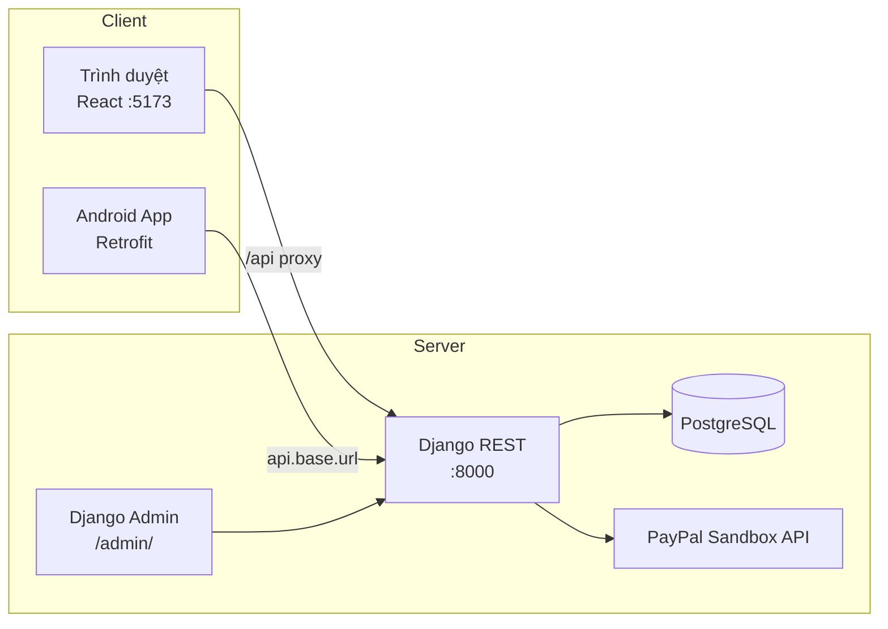
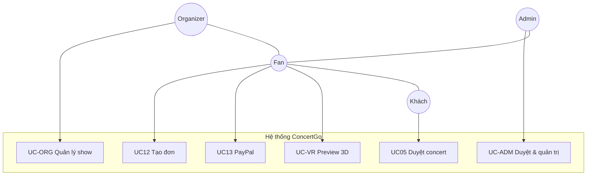
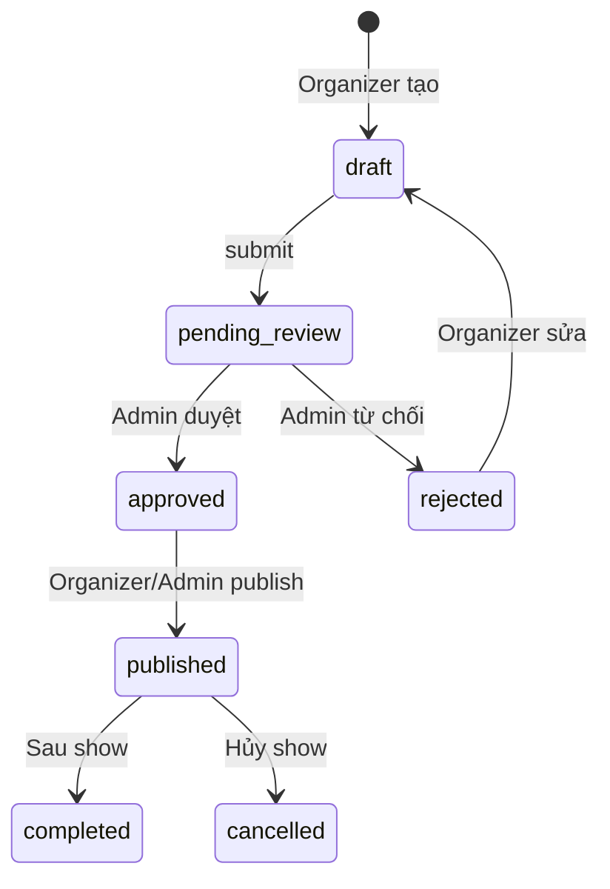
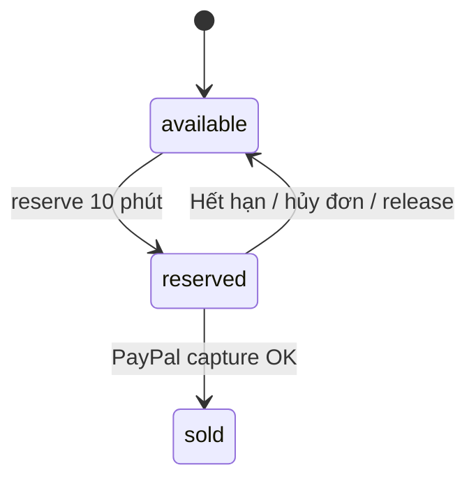

# PHÂN TÍCH THIẾT KẾ HỆ THỐNG ĐẶT VÉ CONCERT

**Dự án:** DATN — Concert Booking System (ConcertGo)  
**Thành phần:** Backend (Django REST) · Web (React/Vite/Three.js) · Mobile (Android Kotlin)  
**CSDL:** PostgreSQL  
**Cập nhật:** 17/06/2026

---

## 1. Tổng quan hệ thống

Hệ thống hỗ trợ **fan** tìm kiếm concert, xem sơ đồ ghế 2D/3D, đặt vé và thanh toán PayPal Sandbox; **nhà tổ chức (organizer)** tạo show, quản lý venue/ghế và theo dõi doanh thu; **admin** duyệt organizer/concert và quản trị platform. Backend cung cấp REST API thống nhất cho web và mobile, xác thực JWT.

### 1.1. Mục tiêu

| Mục tiêu | Mô tả |
|----------|--------|
| MT1 | Kênh đặt vé trực tuyến đa nền tảng (web + Android) |
| MT2 | Sơ đồ ghế theo zone, trạng thái real-time, tọa độ 3D từ GLTF |
| MT3 | Pricing minh bạch (phí đặt chỗ, giao vé, bảo hiểm, voucher) |
| MT4 | Gợi ý concert theo hành vi người dùng |
| MT5 | Portal organizer + admin trên web; Django Admin bổ sung |
| MT6 | Trải nghiệm VR preview venue (Three.js / WebXR) |

### 1.2. Phạm vi

**Trong phạm vi:**
- Đăng ký/đăng nhập (fan + organizer), JWT refresh
- Duyệt concert, yêu thích, chọn ghế, giữ chỗ 10 phút, checkout
- Thanh toán **PayPal Sandbox** (quy đổi VND → USD)
- Xem/hủy đơn, sửa hồ sơ, gợi ý
- Organizer portal: tạo concert, venue, zone, seatmap, thống kê
- Admin portal web: duyệt organizer/concert, users, vouchers, reports
- VR preview sơ đồ venue trên web (`/concerts/:id/vr-preview`)

**Ngoài phạm vi (hiện tại):**
- Cổng thanh toán thật (MoMo, VNPAY, thẻ tín dụng production)
- Push notification, iOS app
- Near Me / Notifications trên mobile (UI placeholder)

---

## 2. Kiến trúc thiết kế

### 2.1. Mô hình phân lớp

```
┌──────────────────────────────────────────────────────────────────┐
│  PRESENTATION LAYER                                               │
│  ┌─────────────────────┐  ┌────────────────────┐  ┌─────────────┐ │
│  │ Web React/Vite      │  │ Web VR (Three.js)  │  │ Android App │ │
│  │ Fan / Organizer /   │  │ VrPreviewPage      │  │ Retrofit    │ │
│  │ Admin zones         │  │                    │  │ + JWT       │ │
│  └──────────┬──────────┘  └─────────┬──────────┘  └──────┬──────┘ │
└─────────────┼───────────────────────┼─────────────────────┼────────┘
              │         HTTP/JSON + JWT Bearer              │
┌─────────────▼─────────────────────────────────────────────▼────────┐
│  APPLICATION LAYER — Django REST Framework 6.0.4                  │
│  users · artists · venues · concerts · seats · orders · behaviors   │
│  organizer (portal) · admin_panel (portal)                          │
│  PayPal integration (urllib → api-m.sandbox.paypal.com)           │
└─────────────┬──────────────────────────────────────────────────────┘
              │
┌─────────────▼──────────────────────────────────────────────────────┐
│  DATA LAYER — PostgreSQL (database: concert)                        │
│  14 bảng nghiệp vụ · UUID PK · migration Django                     │
└────────────────────────────────────────────────────────────────────┘
```

### 2.2. Sơ đồ triển khai



### 2.3. Module backend

| Module | Package | Trách nhiệm |
|--------|---------|-------------|
| Users | `app/users` | Auth, profile, favorites, orders của user, OrganizerProfile |
| Artists | `app/artists` | CRUD nghệ sĩ |
| Venues | `app/venues` | Địa điểm, GLB path cho VR |
| Concerts | `app/concerts` | Concert, filter, seatmap, sync seats |
| Seats | `app/seats` | Zone, ghế, reserve/release, GLTF import |
| Orders | `app/orders` | Đơn hàng, voucher, pricing, PayPal |
| Behaviors | `app/behaviors` | Hành vi, gợi ý, favorites |
| Organizer | `app/organizer` | API portal nhà tổ chức (không có model riêng) |
| Admin panel | `app/admin_panel` | API portal platform admin |

### 2.4. Tech stack

| Thành phần | Công nghệ / phiên bản |
|------------|----------------------|
| Backend | Django 6.0.4, DRF, simplejwt, drf-spectacular, django-filter, python-decouple 3.8 |
| Database | PostgreSQL (psycopg2-binary) |
| Web | React 18.3, Vite 6, TypeScript 5.6, React Router 7, Axios, Zustand |
| 3D/VR | Three.js 0.179, @react-three/fiber, @react-three/drei, @react-three/xr |
| Mobile | Kotlin 2.0, AGP 8.7, compileSdk 36, Retrofit 2.9, Moshi, Navigation 2.8 |
| Thanh toán | PayPal REST Sandbox (`PAYPAL_CLIENT_ID`, `PAYPAL_CLIENT_SECRET`) |

---

## 3. Phân tích tác nhân (Actors)

| STT | Tác nhân | Mô tả |
|-----|----------|--------|
| A1 | **Khách (Guest)** | Chưa đăng nhập. Web: duyệt concert, gợi ý. Mobile: một số màn yêu cầu login để đặt vé. |
| A2 | **Người dùng (User / Fan)** | JWT. Đặt vé, PayPal, yêu thích, hồ sơ, vé của tôi. |
| A3 | **Nhà tổ chức (Organizer)** | Đăng ký kèm `OrganizerProfile`. Chờ admin duyệt → portal `/organizer/*`. |
| A4 | **Quản trị viên (Admin)** | `role=admin` hoặc `is_staff`. Portal `/admin/*` + Django Admin. |

**Quan hệ UML:** Admin và Organizer **generalization** User (quyền mở rộng).

---

## 4. Phân tích use case (tóm tắt)

### 4.1. Nhóm Fan (UC-FAN)

| ID | Use case | Actor |
|----|----------|-------|
| UC01–UC04 | Đăng ký, đăng nhập, đăng xuất, hồ sơ | Guest, User |
| UC05–UC08 | Duyệt concert, chi tiết, seatmap, gợi ý | Guest, User |
| UC09–UC15 | Chọn ghế, reserve, voucher, tạo đơn, PayPal, vé của tôi, hủy | User |
| UC16–UC18 | Yêu thích, danh sách yêu thích, ghi hành vi | User |
| UC-VR | Xem venue 3D / VR preview | User |

### 4.2. Nhóm Organizer (UC-ORG)

| ID | Use case | Mô tả |
|----|----------|--------|
| UC-ORG01 | Đăng ký organizer | Tạo OrganizerProfile `pending` |
| UC-ORG02 | Dashboard / thống kê | Doanh thu, đơn hàng |
| UC-ORG03 | Quản lý concert | draft → submit → publish |
| UC-ORG04 | Quản lý venue & zone | Sinh ghế, seatmap |
| UC-ORG05 | Xem orders / tickets | Theo concert |

### 4.3. Nhóm Admin (UC-ADM)

| ID | Use case | Mô tả |
|----|----------|--------|
| UC-ADM01 | Duyệt / từ chối organizer | approve / reject |
| UC-ADM02 | Duyệt / từ chối concert | workflow review |
| UC-ADM03 | Quản lý users, vouchers, venues | CRUD qua web admin |
| UC-ADM04 | Báo cáo platform | reports API |

> Chi tiết đặc tả UK từng UC: xem `docs/pttk.md`

### 4.4. Sơ đồ use case tổng quát



---

## 5. Activity diagram

### 5.1. Luồng đặt vé + PayPal Sandbox


### 5.2. Workflow concert (Organizer → Admin)



### 5.3. Trạng thái ghế



---

## 6. Quy tắc nghiệp vụ

### 6.1. Công thức tính giá

```
Tổng = Tiền ghế + Phí đặt chỗ (20.000₫) + Phí giao vé + Bảo hiểm − Giảm voucher
```

| Khoản | Giá trị |
|-------|---------|
| Vé giấy (`paper`) | +30.000 ₫ |
| Bảo hiểm | +50.000 ₫ × số ghế |
| Voucher | % trên `seat_subtotal` |
| PayPal | Quy đổi VND → USD (`PAYPAL_VND_PER_USD=25000`) |

### 6.2. Trạng thái đơn hàng

| Trạng thái | Ý nghĩa |
|------------|---------|
| `pending` | Đã tạo, chưa thanh toán PayPal |
| `paid` | Capture PayPal thành công |
| `cancelled` | Đã hủy, ghế trả về available |

### 6.3. Ràng buộc ghế

- Reserve: ghế `available`, TTL **10 phút**, gắn `reserved_by`
- Tạo đơn: ghế phải `reserved` bởi user hiện tại
- Client giới hạn tối đa **6 ghế** / lần chọn
- Thanh toán OK: `reserved` → `sold`

---

## 7. Phân tích phi chức năng

| Thuộc tính | Yêu cầu |
|------------|---------|
| **Bảo mật** | JWT (access 1h, refresh 7 ngày), phân quyền theo role, organizer phải `approved` |
| **Hiệu năng** | Seatmap lớn (~1.600 ghế/venue); `concert_seats` ~480k bản ghi — cần index và pagination |
| **Khả dụng** | Web responsive; mobile Material Design |
| **Tương thích** | Chrome/Edge; Android API 24+; REST JSON |
| **Mở rộng** | Tách client/server; thêm iOS, cổng TT production, push notification |

---

## 8. Ánh xạ Use case ↔ Giao diện ↔ API

| Use case | Web (FE) | Mobile | API chính |
|----------|----------|--------|-----------|
| UC05–UC06 | `/`, `/concerts/:id` | Home, Detail | `GET /api/concerts/concerts/` |
| UC07–UC10 | `/concerts/:id/seats` | SeatSelection | seatmap, reserve |
| UC11–UC13 | `/checkout`, PayPal buttons | CheckoutFragment | validate, create, create_paypal_order, pay |
| UC14–UC15 | `/tickets` | Dashboard | `GET me/orders`, cancel |
| UC-VR | `/concerts/:id/vr-preview` | — | seatmap + GLB static |
| UC-ORG | `/organizer/*` | — | `/api/organizer/*` |
| UC-ADM | `/admin/*` | — | `/api/admin/*` |

---

## 9. Dữ liệu thực tế (snapshot 17/06/2026)

| Thực thể | Số lượng |
|----------|----------|
| Users | 105 |
| Concerts | 300 (published + workflow) |
| Venues | 50 |
| Seats | 44.436 |
| Orders | 406 |
| Concert seats | 479.502 |

Chi tiết schema: `docs/CO_SO_DU_LIEU.md`

---

## 10. Tài liệu tham chiếu

| Nội dung | Đường dẫn |
|----------|-----------|
| Use case & UK chi tiết | `docs/pttk.md` |
| Cơ sở dữ liệu | `docs/CO_SO_DU_LIEU.md` |
| Khởi nghiệp / VR | `docs/MO_HINH_KHOI_NGHIEP_CONCERT_VR.md` |
| API Swagger | `http://localhost:8000/api/docs/` |
| Pricing | `be/app/orders/pricing.py` |
| PayPal | `be/app/orders/payments.py` |
| Web routes | `FE/src/App.tsx` |
