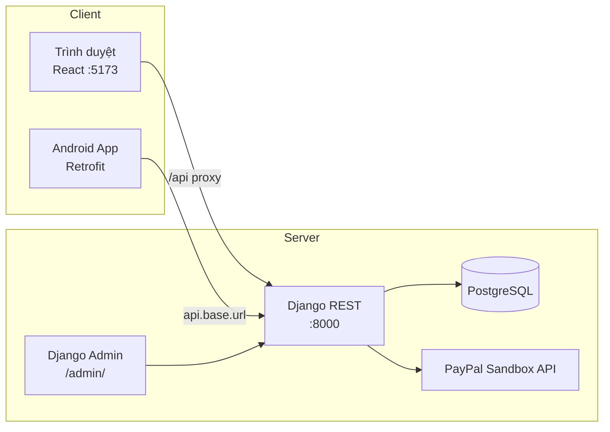
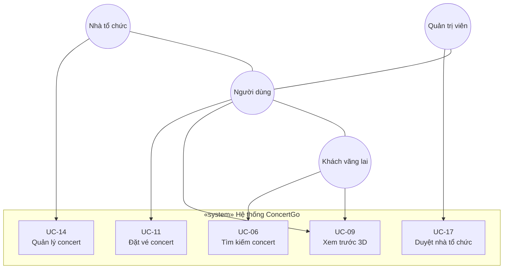
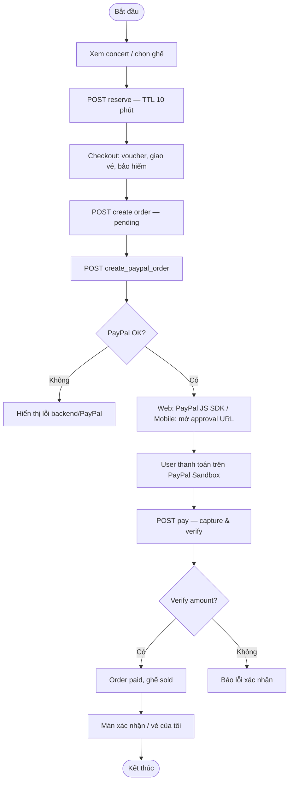
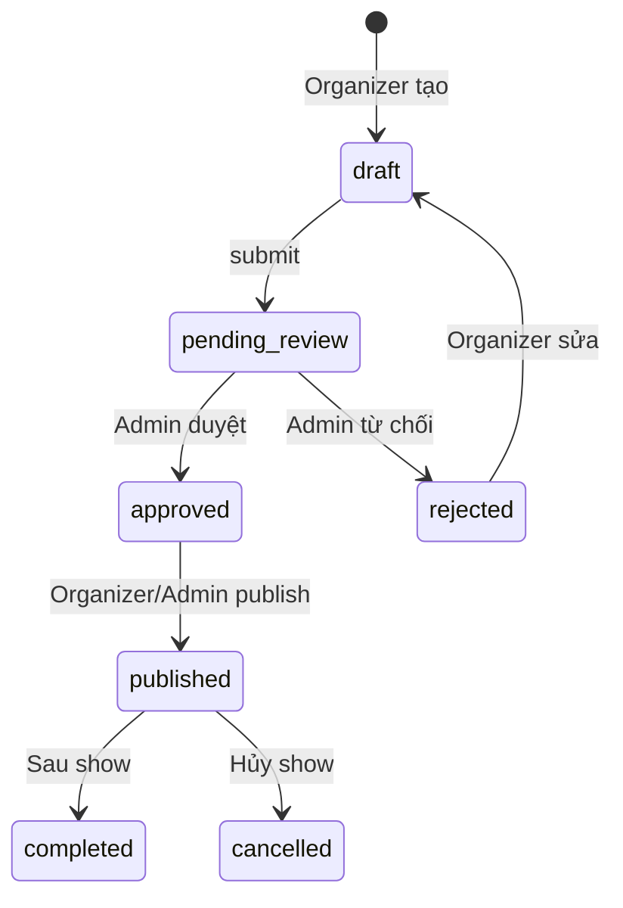
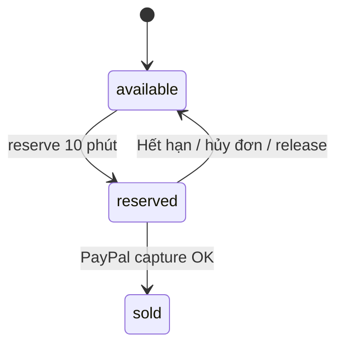

# PHÂN TÍCH THIẾT KẾ HỆ THỐNG ĐẶT VÉ CONCERT

**Dự án:** DATN — Concert Booking System (ConcertGo)  
**Thành phần:** Backend (Django REST) · Web (React/Vite/Three.js) · Mobile (Android Kotlin)  
**CSDL:** PostgreSQL  
**Cập nhật:** 21/06/2026

---

## 1. Tổng quan hệ thống

Hệ thống hỗ trợ **fan** tìm kiếm concert, xem sơ đồ ghế 2D/3D, đặt vé và thanh toán PayPal Sandbox; **nhà tổ chức (organizer)** tạo show, quản lý venue/ghế và theo dõi doanh thu; **admin** duyệt organizer/concert và quản trị platform. Backend cung cấp REST API thống nhất cho web và mobile, xác thực JWT.

### 1.1. Mục tiêu

| Mục tiêu | Mô tả |
|----------|--------|
| MT1 | Kênh đặt vé trực tuyến đa nền tảng (web + Android) |
| MT2 | Sơ đồ ghế theo zone, trạng thái real-time, tọa độ 3D từ GLTF |
| MT3 | Pricing minh bạch (phí đặt chỗ, giao vé, bảo hiểm, voucher) |
| MT4 | Gợi ý concert theo hành vi người dùng |
| MT5 | Portal organizer + admin trên web; Django Admin bổ sung |
| MT6 | Trải nghiệm VR preview venue (Three.js / WebXR) |

### 1.2. Phạm vi

**Trong phạm vi:**
- Đăng ký/đăng nhập (fan + organizer), JWT refresh
- Duyệt concert, yêu thích, chọn ghế, giữ chỗ 10 phút, checkout
- Thanh toán **PayPal Sandbox** (quy đổi VND → USD)
- Xem/hủy đơn, sửa hồ sơ, gợi ý
- Organizer portal: tạo concert, venue, zone, seatmap, thống kê
- Admin portal web: duyệt organizer/concert, users, vouchers, reports
- VR preview sơ đồ venue trên web (`/concerts/:id/vr-preview`)

**Ngoài phạm vi (hiện tại):**
- Cổng thanh toán thật (MoMo, VNPAY, thẻ tín dụng production)
- Push notification, iOS app
- Near Me / Notifications trên mobile (UI placeholder)

---

## 2. Kiến trúc thiết kế

### 2.1. Mô hình phân lớp

```
┌──────────────────────────────────────────────────────────────────┐
│  PRESENTATION LAYER                                               │
│  ┌─────────────────────┐  ┌────────────────────┐  ┌─────────────┐ │
│  │ Web React/Vite      │  │ Web VR (Three.js)  │  │ Android App │ │
│  │ Fan / Organizer /   │  │ VrPreviewPage      │  │ Retrofit    │ │
│  │ Admin zones         │  │                    │  │ + JWT       │ │
│  └──────────┬──────────┘  └─────────┬──────────┘  └──────┬──────┘ │
└─────────────┼───────────────────────┼─────────────────────┼────────┘
              │         HTTP/JSON + JWT Bearer              │
┌─────────────▼─────────────────────────────────────────────▼────────┐
│  APPLICATION LAYER — Django REST Framework 6.0.4                  │
│  users · artists · venues · concerts · seats · orders · behaviors   │
│  organizer (portal) · admin_panel (portal)                          │
│  PayPal integration (urllib → api-m.sandbox.paypal.com)           │
└─────────────┬──────────────────────────────────────────────────────┘
              │
┌─────────────▼──────────────────────────────────────────────────────┐
│  DATA LAYER — PostgreSQL (database: concert)                        │
│  14 bảng nghiệp vụ · UUID PK · migration Django                     │
└────────────────────────────────────────────────────────────────────┘
```

### 2.2. Sơ đồ triển khai



### 2.3. Module backend

| Module | Package | Trách nhiệm |
|--------|---------|-------------|
| Users | `app/users` | Auth, profile, favorites, orders của user, OrganizerProfile |
| Artists | `app/artists` | CRUD nghệ sĩ |
| Venues | `app/venues` | Địa điểm, GLB path cho VR |
| Concerts | `app/concerts` | Concert, filter, seatmap, sync seats |
| Seats | `app/seats` | Zone, ghế, reserve/release, GLTF import |
| Orders | `app/orders` | Đơn hàng, voucher, pricing, PayPal |
| Behaviors | `app/behaviors` | Hành vi, gợi ý, favorites |
| Organizer | `app/organizer` | API portal nhà tổ chức (không có model riêng) |
| Admin panel | `app/admin_panel` | API portal platform admin |

### 2.4. Tech stack

| Thành phần | Công nghệ / phiên bản |
|------------|----------------------|
| Backend | Django 6.0.4, DRF, simplejwt, drf-spectacular, django-filter, python-decouple 3.8 |
| Database | PostgreSQL (psycopg2-binary) |
| Web | React 18.3, Vite 6, TypeScript 5.6, React Router 7, Axios, Zustand |
| 3D/VR | Three.js 0.179, @react-three/fiber, @react-three/drei, @react-three/xr |
| Mobile | Kotlin 2.0, AGP 8.7, compileSdk 36, Retrofit 2.9, Moshi, Navigation 2.8 |
| Thanh toán | PayPal REST Sandbox (`PAYPAL_CLIENT_ID`, `PAYPAL_CLIENT_SECRET`) |

---

## 3. Phân tích tác nhân (Actors)

| STT | Tác nhân | Loại | Mô tả |
|-----|----------|------|--------|
| ACT-01 | **Khách vãng lai** | Primary | Chưa đăng nhập. Tìm kiếm, xem concert, nhận gợi ý chung. |
| ACT-02 | **Người dùng (Fan)** | Primary | Đã đăng nhập. Đặt vé, quản lý hồ sơ, đơn hàng, yêu thích. |
| ACT-03 | **Nhà tổ chức** | Primary | Organizer đã duyệt. Quản lý show, venue, theo dõi bán vé. |
| ACT-04 | **Quản trị viên** | Primary | Duyệt nội dung, quản trị platform. |

**Quan hệ UML:** Nhà tổ chức và Quản trị viên **generalization** Người dùng; Khách vãng lai trở thành Người dùng sau đăng nhập.

> PayPal Sandbox là dịch vụ thanh toán bên ngoài do hệ thống tích hợp — **không** mô hình hóa thành actor trên sơ đồ use case.

---

## 4. Phân tích use case (tóm tắt)

> Chuẩn UML: mỗi UC = một mục tiêu nghiệp vụ; bước con dùng `<<include>>` / `<<extend>>`.  
> Chi tiết đặc tả đầy đủ 22 UC: xem `docs/pttk.md`

### 4.1. Nhóm quản lý tài khoản

| Mã UC | Tên use case | Tác nhân |
|-------|--------------|----------|
| UC-01 | Đăng ký tài khoản người dùng | Khách vãng lai |
| UC-02 | Đăng ký tài khoản nhà tổ chức | Khách vãng lai |
| UC-03 | Đăng nhập hệ thống | Khách vãng lai |
| UC-04 | Đăng xuất khỏi hệ thống | Người dùng |
| UC-05 | Quản lý hồ sơ cá nhân | Người dùng |

### 4.2. Nhóm khám phá & đặt vé

| Mã UC | Tên use case | Tác nhân |
|-------|--------------|----------|
| UC-06 | Tìm kiếm concert | Khách, Người dùng |
| UC-07 | Xem chi tiết concert | Khách, Người dùng |
| UC-08 | Nhận gợi ý concert | Khách, Người dùng |
| UC-09 | Xem trước địa điểm bằng mô hình 3D | Khách, Người dùng |
| UC-10 | Quản lý danh sách yêu thích | Người dùng |
| UC-11 | **Đặt vé concert** *(include: chọn ghế, giữ ghế, tạo đơn, thanh toán)* | Người dùng |
| UC-12 | Xem lịch sử đặt vé | Người dùng |
| UC-13 | Hủy đơn đặt vé chưa thanh toán | Người dùng |

### 4.3. Nhóm nhà tổ chức

| Mã UC | Tên use case | Tác nhân |
|-------|--------------|----------|
| UC-14 | Quản lý concert | Nhà tổ chức |
| UC-15 | Quản lý địa điểm và sơ đồ ghế | Nhà tổ chức |
| UC-16 | Theo dõi bán vé và doanh thu | Nhà tổ chức |

### 4.4. Nhóm quản trị

| Mã UC | Tên use case | Tác nhân |
|-------|--------------|----------|
| UC-17 | Duyệt hồ sơ nhà tổ chức | Quản trị viên |
| UC-18 | Duyệt nội dung concert | Quản trị viên |
| UC-19 | Quản lý người dùng hệ thống | Quản trị viên |
| UC-20 | Quản lý mã giảm giá | Quản trị viên |
| UC-21 | Quản lý dữ liệu nền | Quản trị viên |
| UC-22 | Xem báo cáo tổng hợp hệ thống | Quản trị viên |

### 4.5. Sơ đồ use case tổng quát



---

## 5. Activity diagram

### 5.1. Luồng đặt vé + PayPal Sandbox



### 5.2. Workflow concert (Organizer → Admin)



### 5.3. Trạng thái ghế



---

## 6. Quy tắc nghiệp vụ

### 6.1. Công thức tính giá

```
Tổng = Tiền ghế + Phí đặt chỗ (20.000₫) + Phí giao vé + Bảo hiểm − Giảm voucher
```

| Khoản | Giá trị |
|-------|---------|
| Vé giấy (`paper`) | +30.000 ₫ |
| Bảo hiểm | +50.000 ₫ × số ghế |
| Voucher | % trên `seat_subtotal` |
| PayPal | Quy đổi VND → USD (`PAYPAL_VND_PER_USD=25000`) |

### 6.2. Trạng thái đơn hàng

| Trạng thái | Ý nghĩa |
|------------|---------|
| `pending` | Đã tạo, chưa thanh toán PayPal |
| `paid` | Capture PayPal thành công |
| `cancelled` | Đã hủy, ghế trả về available |

### 6.3. Ràng buộc ghế

- Reserve: ghế `available`, TTL **10 phút**, gắn `reserved_by`
- Tạo đơn: ghế phải `reserved` bởi user hiện tại
- Client giới hạn tối đa **6 ghế** / lần chọn
- Thanh toán OK: `reserved` → `sold`

---

## 7. Phân tích phi chức năng

| Thuộc tính | Yêu cầu |
|------------|---------|
| **Bảo mật** | JWT (access 1h, refresh 7 ngày), phân quyền theo role, organizer phải `approved` |
| **Hiệu năng** | Seatmap lớn (~1.600 ghế/venue); `concert_seats` ~480k bản ghi — cần index và pagination |
| **Khả dụng** | Web responsive; mobile Material Design |
| **Tương thích** | Chrome/Edge; Android API 24+; REST JSON |
| **Mở rộng** | Tách client/server; thêm iOS, cổng TT production, push notification |

---

## 8. Ánh xạ Use case ↔ Giao diện ↔ API

| Mã UC | Web (FE) | Mobile | API chính |
|-------|----------|--------|-----------|
| UC-01–UC-03 | `/register`, `/login` | Login, Register | `/api/users/auth/*` |
| UC-05 | `/profile` | Profile | `GET/PUT /api/users/me/` |
| UC-06–UC-07 | `/`, `/concerts/:id` | Home, Detail | `GET /api/concerts/concerts/` |
| UC-08 | Trang chủ, chi tiết | Home | `GET /api/behaviors/recommend/` |
| UC-09 | `/concerts/:id/vr-preview` | — | seatmap + GLB |
| UC-10 | `/favorites` | Favorites | favorites API |
| UC-11 | `/seats`, `/checkout` | SeatSelection, Checkout | reserve, orders, PayPal |
| UC-12–UC-13 | `/tickets` | Dashboard | `GET me/orders`, cancel |
| UC-14–UC-16 | `/organizer/*` | — | `/api/organizer/*` |
| UC-17–UC-22 | `/admin/*` | — | `/api/admin/*` |

---

## 9. Dữ liệu thực tế (snapshot 17/06/2026)

| Thực thể | Số lượng |
|----------|----------|
| Users | 105 |
| Concerts | 300 (published + workflow) |
| Venues | 50 |
| Seats | 44.436 |
| Orders | 406 |
| Concert seats | 479.502 |

Chi tiết schema: `docs/CO_SO_DU_LIEU.md`

---

## 10. Tài liệu tham chiếu

| Nội dung | Đường dẫn |
|----------|-----------|
| Use case & UK chi tiết | `docs/pttk.md` |
| Cơ sở dữ liệu | `docs/CO_SO_DU_LIEU.md` |
| Khởi nghiệp / VR | `docs/MO_HINH_KHOI_NGHIEP_CONCERT_VR.md` |
| API Swagger | `http://localhost:8000/api/docs/` |
| Pricing | `be/app/orders/pricing.py` |
| PayPal | `be/app/orders/payments.py` |
| Web routes | `FE/src/App.tsx` |
