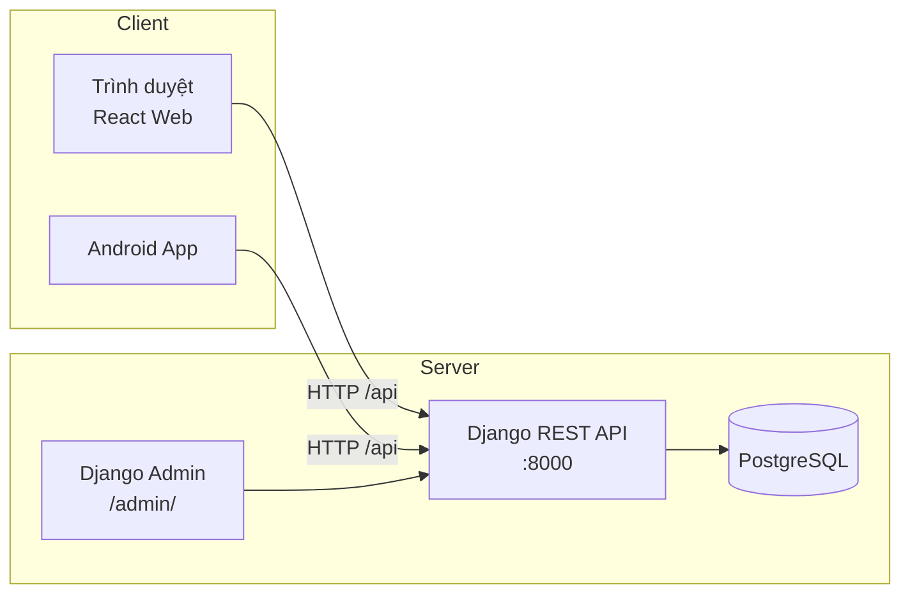
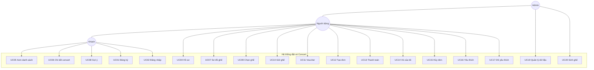
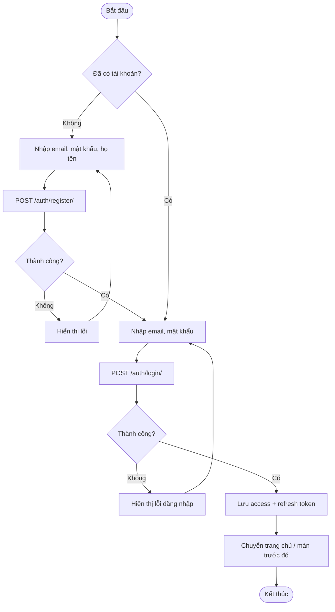
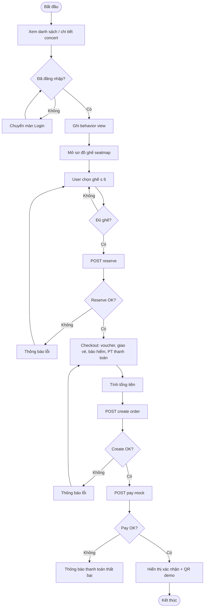
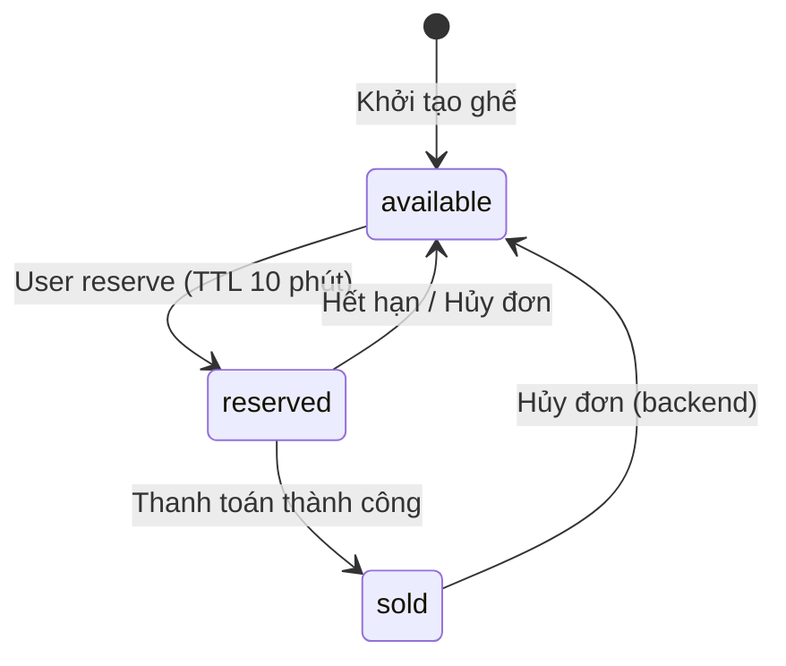
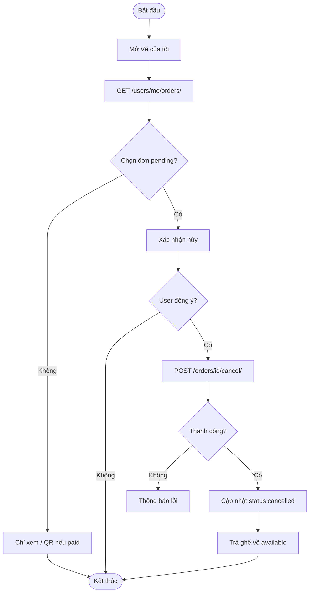
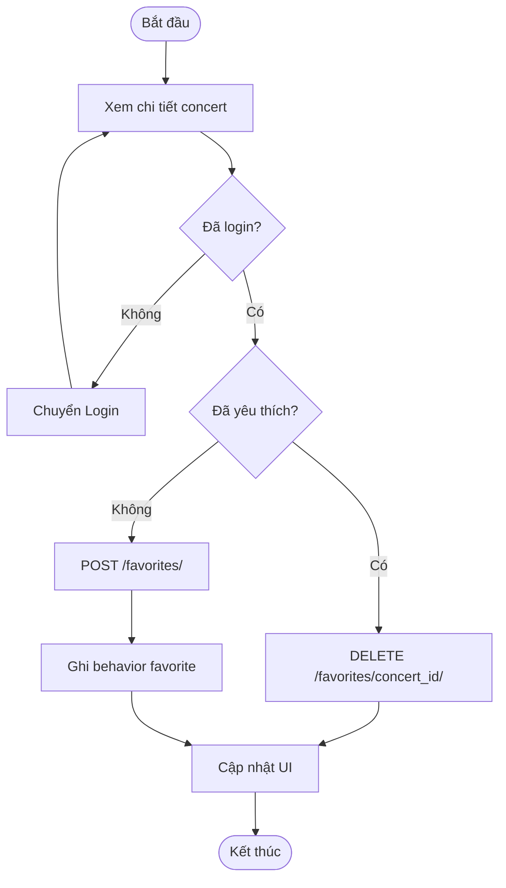
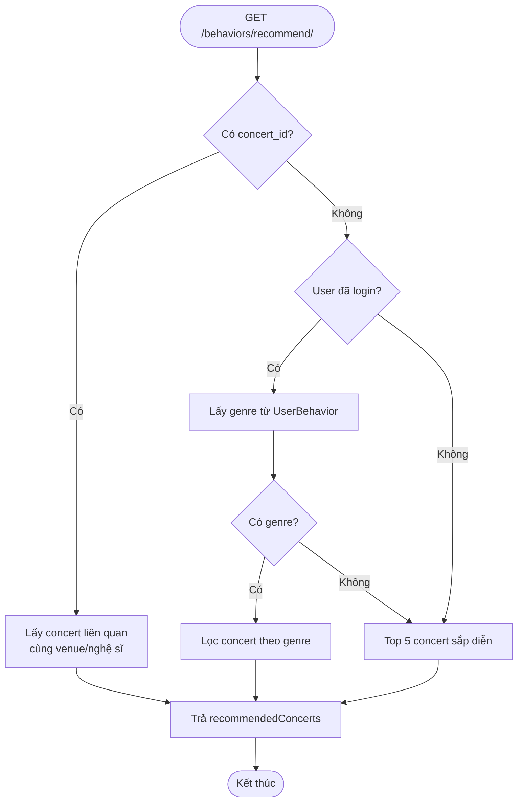

# PHÂN TÍCH THIẾT KẾ HỆ THỐNG ĐẶT VÉ CONCERT

**Dự án:** DATN — Concert Booking System  
**Thành phần:** Backend (Django REST) · Web (React/Vite) · Mobile (Android Kotlin)  
**CSDL:** PostgreSQL

---

## 1. Tổng quan hệ thống

Hệ thống hỗ trợ người dùng **tìm kiếm, xem thông tin concert, chọn ghế, thanh toán và quản lý vé** trên **website** và **ứng dụng Android**. Backend cung cấp REST API thống nhất, xác thực JWT, quản lý dữ liệu concert/ghế/đơn hàng.

### 1.1. Mục tiêu

| Mục tiêu | Mô tả |
|----------|--------|
| MT1 | Cung cấp kênh đặt vé trực tuyến (web + mobile) |
| MT2 | Quản lý sơ đồ ghế theo zone, giá và trạng thái real-time |
| MT3 | Tính giá minh bạch (phí đặt chỗ, giao vé, bảo hiểm, voucher) |
| MT4 | Gợi ý concert dựa trên hành vi người dùng |
| MT5 | Quản trị dữ liệu nghệ sĩ, địa điểm, concert qua Django Admin |

### 1.2. Phạm vi

**Trong phạm vi:** đăng ký/đăng nhập, duyệt concert, yêu thích, chọn ghế, giữ chỗ, checkout, thanh toán mock, xem/hủy đơn, sửa hồ sơ, gợi ý, quản trị CRUD (admin).

**Ngoài phạm vi (hiện tại):** cổng thanh toán thật (MoMo/VNPAY), push notification, UI admin riêng trên web/mobile.

---

## 2. Kiến trúc thiết kế

### 2.1. Mô hình phân lớp (Layered Architecture)

```
┌─────────────────────────────────────────────────────────┐
│  PRESENTATION LAYER                                      │
│  ┌──────────────────┐    ┌──────────────────────────┐   │
│  │  Web (React)     │    │  Mobile (Android/Kotlin) │   │
│  │  localhost:5173  │    │  Retrofit + JWT          │   │
│  └────────┬─────────┘    └────────────┬─────────────┘   │
└───────────┼────────────────────────────┼─────────────────┘
            │         HTTP/JSON + JWT    │
┌───────────▼────────────────────────────▼─────────────────┐
│  APPLICATION LAYER — Django REST Framework               │
│  users · concerts · seats · orders · behaviors           │
└───────────┬──────────────────────────────────────────────┘
            │
┌───────────▼──────────────────────────────────────────────┐
│  DATA LAYER — PostgreSQL                                 │
│  User, Concert, Seat, ConcertSeat, Order, Voucher, ...   │
└──────────────────────────────────────────────────────────┘
```

### 2.2. Sơ đồ triển khai (Deployment)



### 2.3. Module backend

| Module | Package | Trách nhiệm |
|--------|---------|-------------|
| Users | `app/users` | Auth, profile, danh sách đơn |
| Concerts | `app/concerts` | Concert, filter, seatmap |
| Artists/Venues | `app/artists`, `app/venues` | Nghệ sĩ, địa điểm |
| Seats | `app/seats` | Zone, ghế, reserve |
| Orders | `app/orders` | Đơn hàng, voucher, pricing |
| Behaviors | `app/behaviors` | Hành vi, gợi ý, favorites |

---

## 3. Phân tích tác nhân (Actors)

| STT | Tác nhân | Mô tả |
|-----|----------|--------|
| A1 | **Khách (Guest)** | Chưa đăng nhập. Web: xem concert, gợi ý. Mobile: bị chuyển màn Login. |
| A2 | **Người dùng (User)** | Đã đăng nhập JWT. Đặt vé, thanh toán, yêu thích, hồ sơ. |
| A3 | **Quản trị viên (Admin)** | `is_staff`. CRUD qua API + Django Admin, sinh ghế. |

**Quan hệ kế thừa (UML):** Admin **generalization** User (quyền mở rộng).

---

## 4. Phân tích use case

### 4.1. Danh sách use case

#### Nhóm Xác thực (UC-AUTH)

| ID | Use case | Actor | Mô tả |
|----|----------|-------|--------|
| UC01 | Đăng ký tài khoản | Guest | Email, mật khẩu, họ tên |
| UC02 | Đăng nhập | Guest | Nhận JWT access + refresh |
| UC03 | Đăng xuất | User | Xóa token phía client |
| UC04 | Cập nhật hồ sơ | User | Sửa họ tên, avatar URL |

#### Nhóm Concert (UC-CON)

| ID | Use case | Actor | Mô tả |
|----|----------|-------|--------|
| UC05 | Xem danh sách concert | Guest, User | Tìm kiếm, lọc city/genre/date |
| UC06 | Xem chi tiết concert | Guest, User | Thông tin, nghệ sĩ, địa điểm |
| UC07 | Xem sơ đồ ghế | User | Seatmap theo zone |
| UC08 | Xem gợi ý concert | Guest, User | Cá nhân hóa nếu đã login |

#### Nhóm Đặt vé (UC-BOOK)

| ID | Use case | Actor | Mô tả |
|----|----------|-------|--------|
| UC09 | Chọn ghế | User | Tối đa 6 ghế (rule client) |
| UC10 | Giữ ghế (Reserve) | User | Trạng thái reserved, TTL 10 phút |
| UC11 | Áp dụng voucher | User | Validate mã giảm giá |
| UC12 | Tạo đơn hàng | User | Status `pending` |
| UC13 | Thanh toán | User | Mock pay → `paid`, ghế `sold` |
| UC14 | Xem vé của tôi | User | Danh sách đơn + QR demo |
| UC15 | Hủy đơn | User | Chủ yếu UI cho `pending` |

#### Nhóm Yêu thích & Hành vi (UC-FAV)

| ID | Use case | Actor | Mô tả |
|----|----------|-------|--------|
| UC16 | Thêm/xóa yêu thích | User | Favorite concert |
| UC17 | Xem danh sách yêu thích | User | |
| UC18 | Ghi hành vi | User | view, favorite → recommend |

#### Nhóm Quản trị (UC-ADM)

| ID | Use case | Actor | Mô tả |
|----|----------|-------|--------|
| UC19 | Quản lý nghệ sĩ/địa điểm/concert | Admin | CRUD |
| UC20 | Quản lý zone & sinh ghế | Admin | generate-seats |
| UC21 | Quản lý voucher & đơn hàng | Admin | Django Admin |

### 4.2. Sơ đồ use case tổng quát



> **Ghi chú vẽ UML chuẩn (Word/StarUML/draw.io):** dùng hình oval cho use case, stick figure cho actor, hình chữ nhật system boundary, mũi tên `-->` association, tam giác rỗng `--|>` generalization (Admin kế thừa User).

### 4.3. Use case chi tiết — Đặt vé (mẫu)

**UC12 — Tạo đơn hàng**

| Mục | Nội dung |
|-----|----------|
| Tác nhân chính | User |
| Tiền điều kiện | Đã login; ghế đã reserve; còn trong thời hạn giữ |
| Luồng chính | 1. User chọn ghế và qua checkout → 2. Nhập voucher/tùy chọn giao vé/bảo hiểm → 3. Hệ thống tính giá → 4. Gọi API tạo đơn → 5. Trả về order `pending` |
| Luồng thay thế | 3a. Voucher không hợp lệ → thông báo lỗi |
| Hậu điều kiện | Đơn `pending` được lưu; ghế vẫn `reserved` |
| API | `POST /api/orders/orders/` |

---

## 5. Activity diagram (Sơ đồ hoạt động)

### 5.1. Đăng nhập / Đăng ký



### 5.2. Đặt vé concert (luồng chính)



### 5.3. Giữ ghế và quản lý trạng thái ghế



### 5.4. Hủy đơn hàng



### 5.5. Yêu thích concert



### 5.6. Gợi ý concert



---

## 6. Quy tắc nghiệp vụ (Business Rules)

### 6.1. Công thức tính giá

```
Tổng = Tiền ghế + Phí đặt chỗ + Phí giao vé + Bảo hiểm − Giảm voucher
```

| Khoản mục | Giá trị |
|-----------|---------|
| Phí đặt chỗ | 20.000 ₫ / đơn |
| Vé giấy (`paper`) | +30.000 ₫ |
| Bảo hiểm | +50.000 ₫ × số ghế |
| Voucher | `%` trên `seat_subtotal` (VD: DATN10, CONCERT20) |
| Tổng tối thiểu | ≥ 0 |

### 6.2. Trạng thái đơn hàng

| Trạng thái | Ý nghĩa |
|------------|---------|
| `pending` | Đã tạo, chưa thanh toán |
| `paid` | Thanh toán mock thành công |
| `cancelled` | Đã hủy |

### 6.3. Ràng buộc ghế

- Reserve chỉ áp dụng ghế `available`.
- Thời gian giữ: **10 phút** (`reserved_until`).
- Tạo đơn yêu cầu ghế đang `reserved` của user.
- Thanh toán: `reserved` → `sold`.
- Hủy đơn: ghế trả về `available`.

---

## 7. Phân tích phi chức năng

| Thuộc tính | Yêu cầu |
|------------|---------|
| **Bảo mật** | JWT, refresh token, phân quyền API theo role |
| **Hiệu năng** | API timeout 30s; danh sách concert phân trang |
| **Khả dụng** | UI responsive (web); touch target ≥ 48dp (mobile) |
| **Tương thích** | Web: Chrome/Edge; Mobile: Android; API REST JSON |
| **Khả năng mở rộng** | Tách client/server; có thể thêm iOS, cổng TT thật |

---

## 8. Ánh xạ Use case ↔ Giao diện ↔ API

| Use case | Web (FE) | Mobile | API chính |
|----------|----------|--------|-----------|
| UC05 | `/` HomePage | HomeFragment | GET `/api/concerts/concerts/` |
| UC06 | `/concerts/:id` | ConcertDetailFragment | GET `.../concerts/{id}/` |
| UC07–UC10 | `/concerts/:id/seats` | SeatSelectionFragment | GET seatmap, POST reserve |
| UC11–UC13 | `/concerts/:id/checkout` | CheckoutFragment | validate, create, pay |
| UC14–UC15 | `/tickets` | DashboardFragment | GET orders, POST cancel |
| UC16–UC17 | Detail + `/favorites` | FavoritesFragment | favorites CRUD |
| UC04 | `/profile/edit` | NotificationsFragment | GET/PUT `/users/me/` |

---

## 9. Hướng dẫn đưa vào luận văn / Word

1. **Chương phân tích thiết kế:** copy mục 1, 2, 6, 7.
2. **Use case:** dùng bảng mục 4.1 + vẽ lại sơ đồ 4.2 bằng **StarUML**, **draw.io** hoặc **Visual Paradigm** (hình oval chuẩn UML).
3. **Activity diagram:** export từ mermaid (mermaid.live) sang PNG hoặc vẽ lại mục 5.1–5.6.
4. **Sequence diagram (tuỳ chọn):** bổ sung tương tác Client–API–DB cho luồng đặt vé.

### Công cụ gợi ý

| Công cụ | Mục đích |
|---------|----------|
| [mermaid.live](https://mermaid.live) | Xuất PNG activity/use case từ code mermaid |
| draw.io | Vẽ UML chuẩn chỉnh sửa tay |
| StarUML / VP UML | Use case + activity chuẩn đồ án |

---

## 10. Tài liệu tham chiếu mã nguồn

- Backend API: `be/config/urls.py`, Swagger `/api/docs/`
- Pricing: `be/app/orders/pricing.py`
- Web routes: `FE/src/App.tsx`
- Mobile nav: `mobile_app_concert/.../nav_graph.xml`
