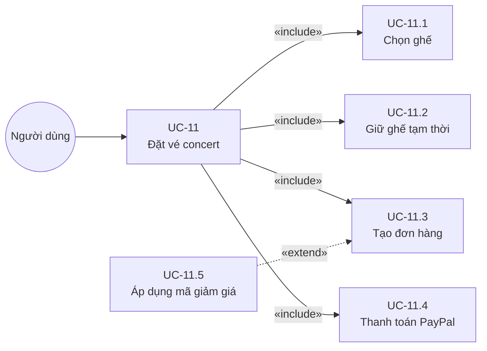
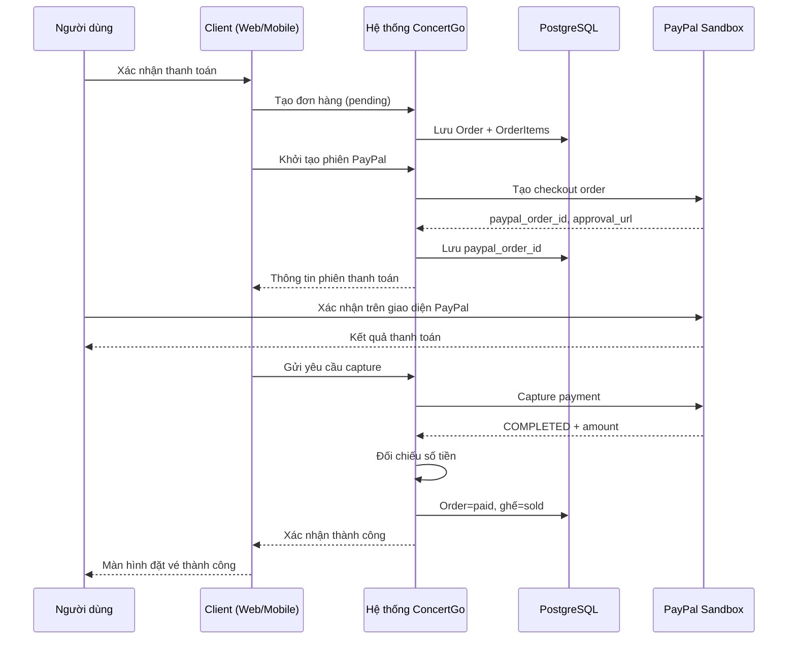

# PHÂN TÍCH THIẾT KẾ — USE CASE & ĐẶC TẢ USE CASE

**Dự án:** DATN — Concert Booking System (ConcertGo)  
**Thành phần:** Backend (Django REST) · Web (React/Vite/Three.js) · Mobile (Android Kotlin)  
**Chuẩn tham chiếu:** UML 2.5 Use Case · Đặc tả theo mẫu Cockburn (luồng chính / luồng mở rộng)  
**Cập nhật:** 21/06/2026

---

# PHẦN 1: MÔ HÌNH USE CASE

## 1. Ranh giới hệ thống (System Boundary)

**Hệ thống ConcertGo** là nền tảng đặt vé concert trực tuyến, gồm:

- API backend (Django REST)
- Ứng dụng web (fan, organizer, admin)
- Ứng dụng Android (fan)

**Dịch vụ bên ngoài (không mô hình hóa thành actor):**

- **PayPal Sandbox** — cổng thanh toán thử nghiệm; hệ thống tích hợp qua API, người dùng tương tác qua giao diện thanh toán do hệ thống cung cấp (UC-11.4).

---

## 2. Tác nhân (Actors)

### 2.1. Bảng tác nhân

| Ký hiệu | Tác nhân | Loại | Mô tả |
|---------|----------|------|--------|
| ACT-01 | **Khách vãng lai** | Primary | Chưa đăng nhập. Có thể tìm kiếm, xem concert, nhận gợi ý chung trên web/mobile. |
| ACT-02 | **Người dùng (Fan)** | Primary | Đã đăng nhập (`role=user`). Đặt vé, thanh toán, quản lý hồ sơ và đơn hàng. |
| ACT-03 | **Nhà tổ chức** | Primary | `role=organizer`, hồ sơ `OrganizerProfile` trạng thái `approved`. Quản lý show, venue, theo dõi bán vé. |
| ACT-04 | **Quản trị viên** | Primary | `role=admin` hoặc `is_staff`. Duyệt nội dung, quản trị platform. |

### 2.2. Quan hệ tác nhân (Generalization)

```
        Khách vãng lai
              ▲
              │ kế thừa (sau khi đăng nhập)
              │
         Người dùng (Fan)
         ╱            ╲
        ▼              ▼
  Nhà tổ chức    Quản trị viên
```

- **Nhà tổ chức** và **Quản trị viên** là dạng đặc biệt của **Người dùng** (cùng cơ chế xác thực, quyền mở rộng).
- **Khách vãng lai** trở thành **Người dùng** sau khi đăng nhập thành công.

---

## 3. Danh sách use case (chuẩn hóa)

### Nguyên tắc đặt tên

1. **Động từ + danh từ**, diễn đạt **mục tiêu nghiệp vụ** (ví dụ: *Đặt vé concert*, không phải *POST /orders*).
2. Một use case = một **mục tiêu hoàn chỉnh** của tác nhân.
3. Các bước bắt buộc bên trong (giữ ghế, tạo đơn…) dùng quan hệ **`<<include>>`**, không tách thành UC độc lập ở cấp sơ đồ tổng quát.
4. Các bước tùy chọn (voucher, bảo hiểm…) dùng quan hệ **`<<extend>>`**.

### 3.1. Nhóm quản lý tài khoản

| Mã UC | Tên use case | Tác nhân chính | Mức |
|-------|--------------|----------------|-----|
| UC-01 | Đăng ký tài khoản người dùng | Khách vãng lai | Mục tiêu người dùng |
| UC-02 | Đăng ký tài khoản nhà tổ chức | Khách vãng lai | Mục tiêu người dùng |
| UC-03 | Đăng nhập hệ thống | Khách vãng lai | Mục tiêu người dùng |
| UC-04 | Đăng xuất khỏi hệ thống | Người dùng | Mục tiêu người dùng |
| UC-05 | Quản lý hồ sơ cá nhân | Người dùng | Mục tiêu người dùng |

### 3.2. Nhóm khám phá concert

| Mã UC | Tên use case | Tác nhân chính | Mức |
|-------|--------------|----------------|-----|
| UC-06 | Tìm kiếm concert | Khách vãng lai, Người dùng | Mục tiêu người dùng |
| UC-07 | Xem chi tiết concert | Khách vãng lai, Người dùng | Mục tiêu người dùng |
| UC-08 | Nhận gợi ý concert | Khách vãng lai, Người dùng | Mục tiêu người dùng |
| UC-09 | Xem trước địa điểm bằng mô hình 3D | Khách vãng lai, Người dùng | Mục tiêu người dùng |
| UC-10 | Quản lý danh sách yêu thích | Người dùng | Mục tiêu người dùng |

### 3.3. Nhóm đặt vé

| Mã UC | Tên use case | Tác nhân chính | Tác nhân phụ | Mức |
|-------|--------------|----------------|--------------|-----|
| UC-11 | Đặt vé concert | Người dùng | — | Mục tiêu người dùng |
| UC-12 | Xem lịch sử đặt vé | Người dùng | — | Mục tiêu người dùng |
| UC-13 | Hủy đơn đặt vé chưa thanh toán | Người dùng | — | Mục tiêu người dùng |

**Use case con (chỉ xuất hiện trong quan hệ `<<include>>` / `<<extend>>`, không vẽ riêng ở sơ đồ tổng quát):**

| Mã | Tên | Quan hệ với UC-11 |
|----|-----|-------------------|
| UC-11.1 | Chọn ghế trên sơ đồ | `<<include>>` |
| UC-11.2 | Giữ ghế tạm thời | `<<include>>` |
| UC-11.3 | Tạo đơn hàng | `<<include>>` |
| UC-11.4 | Thanh toán qua PayPal | `<<include>>` |
| UC-11.5 | Áp dụng mã giảm giá | `<<extend>>` (tùy chọn) |

### 3.4. Nhóm nhà tổ chức

| Mã UC | Tên use case | Tác nhân chính | Mức |
|-------|--------------|----------------|-----|
| UC-14 | Quản lý concert | Nhà tổ chức | Mục tiêu người dùng |
| UC-15 | Quản lý địa điểm và sơ đồ ghế | Nhà tổ chức | Mục tiêu người dùng |
| UC-16 | Theo dõi bán vé và doanh thu | Nhà tổ chức | Mục tiêu người dùng |

### 3.5. Nhóm quản trị

| Mã UC | Tên use case | Tác nhân chính | Mức |
|-------|--------------|----------------|-----|
| UC-17 | Duyệt hồ sơ nhà tổ chức | Quản trị viên | Mục tiêu người dùng |
| UC-18 | Duyệt nội dung concert | Quản trị viên | Mục tiêu người dùng |
| UC-19 | Quản lý người dùng hệ thống | Quản trị viên | Mục tiêu người dùng |
| UC-20 | Quản lý mã giảm giá | Quản trị viên | Mục tiêu người dùng |
| UC-21 | Quản lý dữ liệu nền | Quản trị viên | Mục tiêu người dùng |
| UC-22 | Xem báo cáo tổng hợp hệ thống | Quản trị viên | Mục tiêu người dùng |

**Tổng cộng: 22 use case cấp mục tiêu người dùng** (+ 5 use case con phục vụ UC-11).

---

## 4. Sơ đồ use case tổng quát

```mermaid
flowchart TB
    subgraph Boundary["«system» Hệ thống ConcertGo"]

        subgraph PKG_AUTH["Quản lý tài khoản"]
            UC01["UC-01\nĐăng ký người dùng"]
            UC02["UC-02\nĐăng ký nhà tổ chức"]
            UC03["UC-03\nĐăng nhập"]
            UC04["UC-04\nĐăng xuất"]
            UC05["UC-05\nQuản lý hồ sơ"]
        end

        subgraph PKG_DISC["Khám phá concert"]
            UC06["UC-06\nTìm kiếm concert"]
            UC07["UC-07\nXem chi tiết"]
            UC08["UC-08\nNhận gợi ý"]
            UC09["UC-09\nXem trước 3D"]
            UC10["UC-10\nQuản lý yêu thích"]
        end

        subgraph PKG_BOOK["Đặt vé"]
            UC11["UC-11\nĐặt vé concert"]
            UC12["UC-12\nXem lịch sử đặt vé"]
            UC13["UC-13\nHủy đơn chưa TT"]
        end

        subgraph PKG_ORG["Nhà tổ chức"]
            UC14["UC-14\nQuản lý concert"]
            UC15["UC-15\nQuản lý venue & ghế"]
            UC16["UC-16\nTheo dõi bán vé"]
        end

        subgraph PKG_ADM["Quản trị"]
            UC17["UC-17\nDuyệt nhà tổ chức"]
            UC18["UC-18\nDuyệt concert"]
            UC19["UC-19\nQuản lý người dùng"]
            UC20["UC-20\nQuản lý voucher"]
            UC21["UC-21\nQuản lý dữ liệu nền"]
            UC22["UC-22\nBáo cáo hệ thống"]
        end
    end

    Guest(("ACT-01\nKhách vãng lai"))
    User(("ACT-02\nNgười dùng"))
    Org(("ACT-03\nNhà tổ chức"))
    Admin(("ACT-04\nQuản trị viên"))

    Guest --> UC01 & UC02 & UC03
    Guest --> UC06 & UC07 & UC08 & UC09
    User --> UC04 & UC05 & UC10 & UC11 & UC12 & UC13
    User --> UC06 & UC07 & UC08 & UC09
    Org --> UC14 & UC15 & UC16
    Admin --> UC17 & UC18 & UC19 & UC20 & UC21 & UC22

    UC07 -.->|«include»| UC08
    UC11 -.->|«extend»| UC10
```



### 4.1. Sơ đồ chi tiết UC-11 (Đặt vé concert)



---

## 5. Quy tắc nghiệp vụ (Business Rules)

| Mã BR | Nội dung |
|-------|----------|
| BR-01 | Mỗi lần đặt tối đa **6 ghế**. |
| BR-02 | Ghế được giữ **10 phút**; hết hạn tự trả về trạng thái trống. |
| BR-03 | Công thức giá: `Tổng = Tiền ghế + Phí đặt chỗ (20.000₫) + Phí giao vé + Bảo hiểm − Voucher`. |
| BR-04 | Vé giấy: +30.000₫; Bảo hiểm: +50.000₫ × số ghế. |
| BR-05 | Thanh toán qua PayPal Sandbox; quy đổi VND → USD (`PAYPAL_VND_PER_USD = 25000`). |
| BR-06 | Workflow concert: `draft → pending_review → approved → published`. |
| BR-07 | Nhà tổ chức phải được admin duyệt (`OrganizerProfile.approved`) mới sử dụng portal. |
| BR-08 | Hệ thống ghi nhận hành vi xem/nhấn/yêu thích **ngầm** để phục vụ UC-08; không phải use case riêng. |

### 5.1. Trạng thái ghế

```
available → reserved (TTL 10 phút) → sold (thanh toán thành công)
reserved → available (hết hạn / hủy đơn)
```

### 5.2. Trạng thái đơn hàng

| Trạng thái | Ý nghĩa |
|------------|---------|
| `pending` | Đã tạo, chưa thanh toán |
| `paid` | PayPal capture thành công, ghế chuyển `sold` |
| `cancelled` | Đã hủy, ghế được trả |

---

## 6. Ánh xạ Use Case ↔ Giao diện ↔ API

| Mã UC | Web (FE) | Mobile | API chính |
|-------|----------|--------|-----------|
| UC-01, UC-02 | `/register` | RegisterActivity | `POST /api/users/auth/register/` |
| UC-03 | `/login` | LoginActivity | `POST /api/users/auth/login/` |
| UC-05 | `/profile` | Profile | `GET/PUT /api/users/me/` |
| UC-06, UC-07 | `/`, `/concerts/:id` | Home, Detail | `GET /api/concerts/concerts/` |
| UC-08 | Trang chủ, chi tiết | Home | `GET /api/behaviors/recommend/` |
| UC-09 | `/concerts/:id/vr-preview` | — | seatmap + GLB tĩnh |
| UC-10 | `/favorites` | Favorites | `GET/POST/DELETE favorites` |
| UC-11 | `/seats`, `/checkout` | SeatSelection, Checkout | reserve, orders, PayPal |
| UC-12, UC-13 | `/tickets` | Dashboard | `GET me/orders`, cancel |
| UC-14–UC-16 | `/organizer/*` | — | `/api/organizer/*` |
| UC-17–UC-22 | `/admin/*` | — | `/api/admin/*` |

---

# PHẦN 2: ĐẶC TẢ USE CASE

> **Mẫu chuẩn:** Mỗi UC gồm — Tác nhân chính · Tác nhân phụ · Mô tả tóm tắt · Tiền điều kiện · Hậu điều kiện · Kích hoạt · Luồng sự kiện chính · Luồng mở rộng / Ngoại lệ · Quy tắc nghiệp vụ liên quan.

---

## UC-01 — Đăng ký tài khoản người dùng

| Thuộc tính | Nội dung |
|------------|----------|
| **Tác nhân chính** | Khách vãng lai |
| **Tác nhân phụ** | — |
| **Mô tả tóm tắt** | Khách tạo tài khoản fan mới bằng email để sử dụng các chức năng đặt vé. |
| **Tiền điều kiện** | Email chưa tồn tại trong hệ thống; thiết bị có kết nối mạng. |
| **Hậu điều kiện thành công** | Tài khoản fan được tạo; khách có thể chuyển sang đăng nhập. |
| **Hậu điều kiện thất bại** | Không tạo tài khoản; hiển thị thông báo lỗi cụ thể. |
| **Kích hoạt** | Khách chọn chức năng "Đăng ký" trên web hoặc mobile. |

**Luồng sự kiện chính:**

| Bước | Tác nhân | Hệ thống |
|------|----------|----------|
| 1 | Nhập email, mật khẩu, xác nhận mật khẩu, họ tên. | |
| 2 | Nhấn "Đăng ký". | |
| 3 | | Kiểm tra tính hợp lệ của dữ liệu. |
| 4 | | Lưu tài khoản mới (`role=user`). |
| 5 | | Thông báo thành công và chuyển sang màn hình đăng nhập. |

**Luồng mở rộng / Ngoại lệ:**

| Mã | Điều kiện | Xử lý |
|----|-----------|--------|
| E1 | Email đã tồn tại | Hiển thị lỗi "Email đã được sử dụng", giữ dữ liệu form. |
| E2 | Mật khẩu xác nhận không khớp | Yêu cầu nhập lại, không gửi đăng ký. |
| E3 | Dữ liệu thiếu hoặc sai định dạng | Hiển thị lỗi validation tại từng trường. |

---

## UC-02 — Đăng ký tài khoản nhà tổ chức

| Thuộc tính | Nội dung |
|------------|----------|
| **Tác nhân chính** | Khách vãng lai |
| **Mô tả tóm tắt** | Khách đăng ký tài khoản kèm hồ sơ doanh nghiệp, chờ quản trị viên phê duyệt trước khi vận hành show. |
| **Tiền điều kiện** | Email chưa tồn tại. |
| **Hậu điều kiện thành công** | Tài khoản và `OrganizerProfile` được tạo ở trạng thái `pending`. |
| **Hậu điều kiện thất bại** | Không tạo hồ sơ; hiển thị lỗi. |
| **Kích hoạt** | Khách chọn "Đăng ký làm nhà tổ chức". |

**Luồng sự kiện chính:**

| Bước | Tác nhân | Hệ thống |
|------|----------|----------|
| 1 | Nhập thông tin cá nhân và doanh nghiệp (tên công ty, giấy phép, liên hệ). | |
| 2 | Gửi đơn đăng ký. | |
| 3 | | Tạo tài khoản `role=organizer`, profile trạng thái `pending`. |
| 4 | | Thông báo đăng ký thành công, hướng dẫn chờ duyệt. |

**Luồng mở rộng / Ngoại lệ:**

| Mã | Điều kiện | Xử lý |
|----|-----------|--------|
| E1 | Thiếu thông tin bắt buộc | Báo lỗi, không lưu. |
| E2 | Email trùng | Báo lỗi như UC-01-E1. |

**Quy tắc nghiệp vụ:** BR-07

---

## UC-03 — Đăng nhập hệ thống

| Thuộc tính | Nội dung |
|------------|----------|
| **Tác nhân chính** | Khách vãng lai |
| **Mô tả tóm tắt** | Xác thực danh tính bằng email/mật khẩu để truy cập chức năng theo vai trò. |
| **Tiền điều kiện** | Tài khoản đã tồn tại. |
| **Hậu điều kiện thành công** | Phiên đăng nhập được thiết lập; điều hướng theo vai trò (fan / organizer / admin). |
| **Hậu điều kiện thất bại** | Không thiết lập phiên; hiển thị lỗi. |
| **Kích hoạt** | Khách chọn "Đăng nhập" hoặc bị chuyển hướng khi truy cập chức năng yêu cầu xác thực. |

**Luồng sự kiện chính:**

| Bước | Tác nhân | Hệ thống |
|------|----------|----------|
| 1 | Nhập email và mật khẩu. | |
| 2 | Nhấn "Đăng nhập". | |
| 3 | | Xác minh thông tin. |
| 4 | | Cấp token JWT (access + refresh). |
| 5 | | Điều hướng: fan → trang chủ; organizer `pending` → trang chờ duyệt; organizer `approved` → dashboard; admin → khu quản trị. |

**Luồng mở rộng / Ngoại lệ:**

| Mã | Điều kiện | Xử lý |
|----|-----------|--------|
| E1 | Sai email hoặc mật khẩu | Báo "Thông tin đăng nhập không đúng". |
| E2 | Tài khoản bị vô hiệu hóa | Báo lỗi, không cấp token. |

---

## UC-04 — Đăng xuất khỏi hệ thống

| Thuộc tính | Nội dung |
|------------|----------|
| **Tác nhân chính** | Người dùng |
| **Mô tả tóm tắt** | Kết thúc phiên làm việc trên thiết bị hiện tại. |
| **Tiền điều kiện** | Đang ở trạng thái đã đăng nhập. |
| **Hậu điều kiện thành công** | Token client bị xóa; không truy cập được chức năng bảo vệ. |
| **Kích hoạt** | Chọn "Đăng xuất". |

**Luồng sự kiện chính:**

| Bước | Tác nhân | Hệ thống |
|------|----------|----------|
| 1 | Chọn đăng xuất. | |
| 2 | | Xóa token trên client. |
| 3 | | Chuyển về trang công khai hoặc trang đăng nhập. |

---

## UC-05 — Quản lý hồ sơ cá nhân

| Thuộc tính | Nội dung |
|------------|----------|
| **Tác nhân chính** | Người dùng |
| **Mô tả tóm tắt** | Xem và cập nhật thông tin hiển thị của tài khoản. |
| **Tiền điều kiện** | Đã đăng nhập. |
| **Hậu điều kiện thành công** | Hồ sơ được cập nhật và phản ánh trên giao diện. |
| **Kích hoạt** | Mở trang "Hồ sơ cá nhân". |

**Luồng sự kiện chính:**

| Bước | Tác nhân | Hệ thống |
|------|----------|----------|
| 1 | Mở trang hồ sơ. | Hiển thị thông tin hiện tại. |
| 2 | Sửa họ tên hoặc ảnh đại diện. | |
| 3 | Nhấn "Lưu". | |
| 4 | | Kiểm tra và lưu thay đổi. |
| 5 | | Thông báo cập nhật thành công. |

**Luồng mở rộng / Ngoại lệ:**

| Mã | Điều kiện | Xử lý |
|----|-----------|--------|
| E1 | Dữ liệu không hợp lệ | Báo lỗi, không lưu. |

---

## UC-06 — Tìm kiếm concert

| Thuộc tính | Nội dung |
|------------|----------|
| **Tác nhân chính** | Khách vãng lai, Người dùng |
| **Mô tả tóm tắt** | Duyệt và lọc danh sách concert theo từ khóa, thể loại, thành phố, ngày diễn. |
| **Tiền điều kiện** | Hệ thống có dữ liệu concert công khai (`published`). |
| **Hậu điều kiện thành công** | Danh sách concert phù hợp được hiển thị. |
| **Kích hoạt** | Mở trang chủ hoặc nhập tiêu chí tìm kiếm. |

**Luồng sự kiện chính:**

| Bước | Tác nhân | Hệ thống |
|------|----------|----------|
| 1 | Mở trang chủ. | Tải danh sách concert đang mở bán. |
| 2 | (Tuỳ chọn) Nhập từ khóa hoặc chọn bộ lọc. | |
| 3 | | Lọc và sắp xếp kết quả. |
| 4 | | Hiển thị danh sách kèm thông tin tóm tắt (ảnh, ngày, địa điểm). |

**Luồng mở rộng / Ngoại lệ:**

| Mã | Điều kiện | Xử lý |
|----|-----------|--------|
| E1 | Không có kết quả | Hiển thị "Không tìm thấy concert phù hợp". |
| E2 | Lỗi mạng | Hiển thị thông báo lỗi và nút thử lại. |

---

## UC-07 — Xem chi tiết concert

| Thuộc tính | Nội dung |
|------------|----------|
| **Tác nhân chính** | Khách vãng lai, Người dùng |
| **Mô tả tóm tắt** | Xem thông tin đầy đủ của một buổi concert trước khi quyết định đặt vé. |
| **Tiền điều kiện** | Concert tồn tại và ở trạng thái hiển thị công khai. |
| **Hậu điều kiện thành công** | Thông tin concert, nghệ sĩ, địa điểm được hiển thị. |
| **Kích hoạt** | Chọn một concert từ danh sách hoặc gợi ý. |

**Luồng sự kiện chính:**

| Bước | Tác nhân | Hệ thống |
|------|----------|----------|
| 1 | Chọn concert. | |
| 2 | | Hiển thị tiêu đề, mô tả, thời gian, banner, nghệ sĩ, venue. |
| 3 | | (Ngầm) Ghi nhận hành vi xem nếu đã đăng nhập — phục vụ UC-08 (BR-08). |
| 4 | | Hiển thị các hành động: "Chọn ghế", "Xem trước 3D", "Yêu thích" (nếu đã login). |

**Luồng mở rộng / Ngoại lệ:**

| Mã | Điều kiện | Xử lý |
|----|-----------|--------|
| E1 | Concert không tồn tại | Hiển thị lỗi 404, quay về danh sách. |
| E2 | Chưa đăng nhập, chọn đặt vé (mobile) | Chuyển sang UC-03. |
| A1 | Tại bước 2 | **`«include»` UC-08** — hiển thị gợi ý concert liên quan. |

---

## UC-08 — Nhận gợi ý concert

| Thuộc tính | Nội dung |
|------------|----------|
| **Tác nhân chính** | Khách vãng lai, Người dùng |
| **Mô tả tóm tắt** | Hệ thống đề xuất concert phù hợp dựa trên ngữ cảnh xem và lịch sử tương tác. |
| **Tiền điều kiện** | Có dữ liệu concert trong hệ thống. |
| **Hậu điều kiện thành công** | Danh sách gợi ý được hiển thị. |
| **Kích hoạt** | Tải trang chủ hoặc xem chi tiết concert (được gọi bởi UC-06, UC-07). |

**Luồng sự kiện chính:**

| Bước | Tác nhân | Hệ thống |
|------|----------|----------|
| 1 | | Xác định ngữ cảnh (trang chủ / đang xem concert X). |
| 2 | | Nếu đã đăng nhập: ưu tiên cùng thể loại/artist từ lịch sử hành vi. |
| 3 | | Nếu khách: gợi ý concert sắp diễn hoặc cùng venue/artist với concert đang xem. |
| 4 | | Hiển thị mục "Gợi ý cho bạn". |

**Luồng mở rộng / Ngoại lệ:**

| Mã | Điều kiện | Xử lý |
|----|-----------|--------|
| E1 | Không đủ dữ liệu gợi ý | Hiển thị concert phổ biến hoặc ẩn mục gợi ý. |

**Quy tắc nghiệp vụ:** BR-08

---

## UC-09 — Xem trước địa điểm bằng mô hình 3D

| Thuộc tính | Nội dung |
|------------|----------|
| **Tác nhân chính** | Khách vãng lai, Người dùng |
| **Mô tả tóm tắt** | Quan sát không gian venue dạng 3D để hình dung vị trí ghế trước khi mua vé. |
| **Tiền điều kiện** | Venue có mô hình GLB; trình duyệt hỗ trợ WebGL (chỉ web). |
| **Hậu điều kiện thành công** | Người dùng quan sát được mô hình 3D. |
| **Kích hoạt** | Chọn "Xem trước 3D" / "VR Preview" trên trang chi tiết concert. |

**Luồng sự kiện chính:**

| Bước | Tác nhân | Hệ thống |
|------|----------|----------|
| 1 | Mở trang xem trước 3D. | |
| 2 | | Tải mô hình venue và vị trí ghế. |
| 3 | Xoay, phóng to/thu nhỏ mô hình. | |
| 4 | (Tuỳ chọn) Chọn ghế trên mô hình 3D. | Đánh dấu ghế đã chọn. |
| 5 | (Tuỳ chọn) Chuyển sang đặt vé. | Điều hướng tới UC-11. |

**Luồng mở rộng / Ngoại lệ:**

| Mã | Điều kiện | Xử lý |
|----|-----------|--------|
| E1 | Venue chưa có mô hình 3D | Ẩn nút hoặc báo "Chưa hỗ trợ xem trước 3D". |
| E2 | Chưa đăng nhập, chọn đặt vé | Chuyển UC-03 trước khi vào UC-11. |

---

## UC-10 — Quản lý danh sách yêu thích

| Thuộc tính | Nội dung |
|------------|----------|
| **Tác nhân chính** | Người dùng |
| **Mô tả tóm tắt** | Thêm, xóa và xem lại các concert đã đánh dấu yêu thích. |
| **Tiền điều kiện** | Đã đăng nhập. |
| **Hậu điều kiện thành công** | Danh sách yêu thích phản ánh đúng thao tác của người dùng. |
| **Kích hoạt** | Nhấn biểu tượng yêu thích hoặc mở trang "Yêu thích". |

**Luồng sự kiện chính (xem danh sách):**

| Bước | Tác nhân | Hệ thống |
|------|----------|----------|
| 1 | Mở trang yêu thích. | |
| 2 | | Tải danh sách concert đã lưu. |
| 3 | | Hiển thị danh sách; cho phép mở chi tiết hoặc bỏ yêu thích. |

**Luồng sự kiện chính (thêm yêu thích):**

| Bước | Tác nhân | Hệ thống |
|------|----------|----------|
| 1 | Nhấn "Thêm yêu thích" tại trang chi tiết. | |
| 2 | | Lưu concert vào danh sách yêu thích. |
| 3 | | Cập nhật biểu tượng trạng thái. |

**Luồng mở rộng / Ngoại lệ:**

| Mã | Điều kiện | Xử lý |
|----|-----------|--------|
| E1 | Danh sách trống | Hiển thị trạng thái "Chưa có concert yêu thích". |
| A1 | Bỏ yêu thích | Xóa khỏi danh sách, cập nhật giao diện. |

---

## UC-11 — Đặt vé concert

| Thuộc tính | Nội dung |
|------------|----------|
| **Tác nhân chính** | Người dùng |
| **Tác nhân phụ** | — |
| **Mô tả tóm tắt** | Người dùng chọn ghế, giữ chỗ, tạo đơn và thanh toán (qua giao diện PayPal do hệ thống tích hợp) để sở hữu vé concert. |
| **Tiền điều kiện** | Đã đăng nhập; concert `published`; còn ghế trống. |
| **Hậu điều kiện thành công** | Đơn hàng `paid`; ghế chuyển `sold`; người dùng nhận xác nhận đặt vé. |
| **Hậu điều kiện thất bại** | Không trừ tiền; ghế không chuyển `sold`; đơn vẫn `pending` hoặc bị hủy. |
| **Kích hoạt** | Chọn "Chọn ghế" / "Đặt vé" từ trang chi tiết concert. |

**Luồng sự kiện chính:**

| Bước | Tác nhân | Hệ thống |
|------|----------|----------|
| 1 | | **`«include»` UC-11.1** — Hiển thị sơ đồ ghế theo zone, giá, trạng thái. |
| 2 | Chọn ghế còn trống (≤ 6 ghế). | Cập nhật danh sách ghế đã chọn và tổng tiền tạm tính. |
| 3 | Xác nhận chọn ghế. | |
| 4 | | **`«include»` UC-11.2** — Giữ ghế 10 phút cho người dùng hiện tại. |
| 5 | Chọn hình thức nhận vé, bảo hiểm; xem bảng chi tiết giá. | |
| 6 | (Tuỳ chọn) | **`«extend»` UC-11.5** — Áp dụng mã giảm giá hợp lệ. |
| 7 | Nhấn "Thanh toán". | |
| 8 | | **`«include»` UC-11.3** — Tạo đơn hàng trạng thái `pending`. |
| 9 | | **`«include»` UC-11.4** — Khởi tạo phiên thanh toán và hiển thị giao diện PayPal Sandbox. |
| 10 | Xác nhận thanh toán trên giao diện PayPal (web: embedded; mobile: trình duyệt). | |
| 11 | | Hệ thống gọi API PayPal, xác minh số tiền capture; cập nhật đơn `paid`, ghế `sold`. |
| 12 | | Hiển thị màn hình xác nhận thành công. |

**Luồng mở rộng / Ngoại lệ:**

| Mã | Điều kiện | Xử lý |
|----|-----------|--------|
| E1 | Chưa đăng nhập | Chuyển UC-03. |
| E2 | Chọn quá 6 ghế | Cảnh báo, không cho thêm (BR-01). |
| E3 | Ghế vừa bị người khác giữ/mua | Báo lỗi, yêu cầu chọn lại. |
| E4 | Hết thời gian giữ ghế (10 phút) | Ghế trả về trống; quay lại bước 1 (BR-02). |
| E5 | Người dùng hủy trên PayPal | Đơn vẫn `pending`; có thể thử lại hoặc UC-13. |
| E6 | Số tiền PayPal không khớp | Từ chối xác nhận, không chuyển ghế `sold`. |
| E7 | PayPal chưa cấu hình / lỗi mạng | Báo lỗi hệ thống, không hoàn tất thanh toán. |

**Quy tắc nghiệp vụ:** BR-01, BR-02, BR-03, BR-04, BR-05

---

## UC-12 — Xem lịch sử đặt vé

| Thuộc tính | Nội dung |
|------------|----------|
| **Tác nhân chính** | Người dùng |
| **Mô tả tóm tắt** | Xem lại các đơn đặt vé đã thực hiện và trạng thái từng đơn. |
| **Tiền điều kiện** | Đã đăng nhập. |
| **Hậu điều kiện thành công** | Danh sách đơn hàng hiển thị theo thời gian mới nhất. |
| **Kích hoạt** | Mở "Vé của tôi" / tab Dashboard (mobile). |

**Luồng sự kiện chính:**

| Bước | Tác nhân | Hệ thống |
|------|----------|----------|
| 1 | Mở trang vé của tôi. | |
| 2 | | Tải danh sách đơn (tên concert, ngày, tổng tiền, trạng thái). |
| 3 | (Tuỳ chọn) Xem chi tiết đơn đã thanh toán. | Hiển thị ghế, mã vé demo. |
| 4 | (Tuỳ chọn) Với đơn `pending`, chọn hủy. | **`«extend»` UC-13**. |

**Luồng mở rộng / Ngoại lệ:**

| Mã | Điều kiện | Xử lý |
|----|-----------|--------|
| E1 | Chưa có đơn | Hiển thị "Bạn chưa có vé nào". |

---

## UC-13 — Hủy đơn đặt vé chưa thanh toán

| Thuộc tính | Nội dung |
|------------|----------|
| **Tác nhân chính** | Người dùng |
| **Mô tả tóm tắt** | Hủy đơn đang chờ thanh toán và trả ghế cho người khác đặt. |
| **Tiền điều kiện** | Đơn thuộc người dùng hiện tại; trạng thái `pending`. |
| **Hậu điều kiện thành công** | Đơn `cancelled`; ghế trở về `available`. |
| **Kích hoạt** | Chọn "Hủy đơn" trên đơn `pending`. |

**Luồng sự kiện chính:**

| Bước | Tác nhân | Hệ thống |
|------|----------|----------|
| 1 | Mở chi tiết đơn `pending`. | |
| 2 | Chọn hủy và xác nhận. | |
| 3 | | Cập nhật đơn `cancelled`. |
| 4 | | Trả ghế về trạng thái trống. |

**Luồng mở rộng / Ngoại lệ:**

| Mã | Điều kiện | Xử lý |
|----|-----------|--------|
| E1 | Người dùng không xác nhận | Huỷ thao tác, giữ nguyên đơn. |
| E2 | Đơn đã `paid` | Không cho hủy qua luồng này; hướng dẫn liên hệ hỗ trợ. |

---

## UC-14 — Quản lý concert

| Thuộc tính | Nội dung |
|------------|----------|
| **Tác nhân chính** | Nhà tổ chức |
| **Mô tả tóm tắt** | Tạo, chỉnh sửa, gửi duyệt và công bố concert do mình sở hữu. |
| **Tiền điều kiện** | Hồ sơ organizer trạng thái `approved`. |
| **Hậu điều kiện thành công** | Concert được lưu đúng trạng thái workflow. |
| **Kích hoạt** | Vào mục "Quản lý concert" trong portal organizer. |

**Luồng sự kiện chính:**

| Bước | Tác nhân | Hệ thống |
|------|----------|----------|
| 1 | Tạo concert mới (trạng thái `draft`). | |
| 2 | Nhập tiêu đề, mô tả, thời gian, venue, nghệ sĩ. | Lưu bản nháp. |
| 3 | Chỉnh sửa cho đến khi hoàn thiện. | |
| 4 | Gửi admin duyệt. | Chuyển `pending_review`. |
| 5 | (Sau khi admin duyệt — UC-18) Công bố concert. | Chuyển `published`; fan có thể đặt vé. |

**Luồng mở rộng / Ngoại lệ:**

| Mã | Điều kiện | Xử lý |
|----|-----------|--------|
| E1 | Admin từ chối | Concert `rejected`; organizer sửa và gửi lại từ `draft`. |
| E2 | Hồ sơ chưa duyệt | Chặn truy cập portal; hiển thị trang chờ duyệt. |

**Quy tắc nghiệp vụ:** BR-06, BR-07

---

## UC-15 — Quản lý địa điểm và sơ đồ ghế

| Thuộc tính | Nội dung |
|------------|----------|
| **Tác nhân chính** | Nhà tổ chức |
| **Mô tả tóm tắt** | Thiết lập venue, khu ghế, giá vé và sinh sơ đồ ghế cho buổi diễn. |
| **Tiền điều kiện** | Organizer đã được duyệt. |
| **Hậu điều kiện thành công** | Venue có zone và ghế hợp lệ, sẵn sàng gắn với concert. |
| **Kích hoạt** | Vào mục quản lý venue / seatmap trong portal. |

**Luồng sự kiện chính:**

| Bước | Tác nhân | Hệ thống |
|------|----------|----------|
| 1 | Tạo hoặc chọn venue. | |
| 2 | Định nghĩa các khu ghế (tên, giá, màu). | |
| 3 | Yêu cầu sinh ghế theo lưới hoặc import từ mô hình 3D. | Tạo bản ghi ghế và tọa độ. |
| 4 | Xem trước sơ đồ ghế. | Hiển thị seatmap 2D/3D. |

---

## UC-16 — Theo dõi bán vé và doanh thu

| Thuộc tính | Nội dung |
|------------|----------|
| **Tác nhân chính** | Nhà tổ chức |
| **Mô tả tóm tắt** | Xem tổng quan và chi tiết đơn hàng, số vé đã bán, doanh thu theo concert. |
| **Tiền điều kiện** | Organizer đã được duyệt; có ít nhất một concert. |
| **Hậu điều kiện thành công** | Số liệu bán vé/doanh thu được hiển thị. |
| **Kích hoạt** | Mở Dashboard, Orders, Statistics hoặc Tickets trong portal. |

**Luồng sự kiện chính:**

| Bước | Tác nhân | Hệ thống |
|------|----------|----------|
| 1 | Mở trang tổng quan. | Hiển thị số concert, đơn hàng, doanh thu tổng hợp. |
| 2 | (Tuỳ chọn) Chọn một concert cụ thể. | |
| 3 | | Hiển thị danh sách đơn hoặc thống kê vé theo zone. |
| 4 | (Tuỳ chọn) Mở trang thống kê chi tiết. | Biểu đồ/bảng doanh thu theo thời gian. |

---

## UC-17 — Duyệt hồ sơ nhà tổ chức

| Thuộc tính | Nội dung |
|------------|----------|
| **Tác nhân chính** | Quản trị viên |
| **Mô tả tóm tắt** | Xem xét và phê duyệt hoặc từ chối hồ sơ đăng ký nhà tổ chức. |
| **Tiền điều kiện** | Có hồ sơ ở trạng thái `pending`. |
| **Hậu điều kiện thành công** | Trạng thái hồ sơ cập nhật `approved` hoặc `rejected`. |
| **Kích hoạt** | Mở danh sách nhà tổ chức chờ duyệt trong khu admin. |

**Luồng sự kiện chính:**

| Bước | Tác nhân | Hệ thống |
|------|----------|----------|
| 1 | Mở danh sách chờ duyệt. | Hiển thị thông tin công ty, giấy phép. |
| 2 | Xem xét hồ sơ. | |
| 3 | Chọn "Duyệt" hoặc "Từ chối" (kèm lý do). | |
| 4 | | Cập nhật trạng thái profile. |
| 5 | | Nhà tổ chức được duyệt có thể truy cập portal (UC-14). |

---

## UC-18 — Duyệt nội dung concert

| Thuộc tính | Nội dung |
|------------|----------|
| **Tác nhân chính** | Quản trị viên |
| **Mô tả tóm tắt** | Kiểm duyệt concert do nhà tổ chức gửi trước khi được công bố. |
| **Tiền điều kiện** | Concert ở trạng thái `pending_review`. |
| **Hậu điều kiện thành công** | Concert chuyển `approved` hoặc `rejected`. |
| **Kích hoạt** | Mở danh sách concert chờ duyệt. |

**Luồng sự kiện chính:**

| Bước | Tác nhân | Hệ thống |
|------|----------|----------|
| 1 | Mở danh sách concert chờ duyệt. | |
| 2 | Xem nội dung, thời gian, venue. | |
| 3 | Duyệt hoặc từ chối kèm ghi chú. | |
| 4 | | Cập nhật trạng thái workflow. |

**Quy tắc nghiệp vụ:** BR-06

---

## UC-19 — Quản lý người dùng hệ thống

| Thuộc tính | Nội dung |
|------------|----------|
| **Tác nhân chính** | Quản trị viên |
| **Mô tả tóm tắt** | Tra cứu, lọc, thay đổi vai trò hoặc vô hiệu hóa tài khoản người dùng. |
| **Kích hoạt** | Mở `/admin/users`. |

**Luồng sự kiện chính:**

| Bước | Tác nhân | Hệ thống |
|------|----------|----------|
| 1 | Mở danh sách người dùng. | Hiển thị bảng có bộ lọc. |
| 2 | (Tuỳ chọn) Tìm theo email/tên/vai trò. | |
| 3 | (Tuỳ chọn) Vô hiệu hóa hoặc đổi vai trò. | Cập nhật tài khoản. |

---

## UC-20 — Quản lý mã giảm giá

| Thuộc tính | Nội dung |
|------------|----------|
| **Tác nhân chính** | Quản trị viên |
| **Mô tả tóm tắt** | Tạo, sửa, bật/tắt mã voucher phục vụ đặt vé. |
| **Kích hoạt** | Mở `/admin/vouchers`. |

**Luồng sự kiện chính:**

| Bước | Tác nhân | Hệ thống |
|------|----------|----------|
| 1 | Mở danh sách voucher. | |
| 2 | Tạo hoặc sửa mã (phần trăm giảm, thời hạn, trạng thái). | Lưu cấu hình. |
| 3 | (Tuỳ chọn) Vô hiệu hóa mã. | Mã không còn dùng được ở UC-11.5. |

---

## UC-21 — Quản lý dữ liệu nền

| Thuộc tính | Nội dung |
|------------|----------|
| **Tác nhân chính** | Quản trị viên |
| **Mô tả tóm tắt** | Quản lý nghệ sĩ, địa điểm, concert qua portal web hoặc Django Admin. |
| **Kích hoạt** | Mở các mục Venues, Concerts trong khu admin. |

**Luồng sự kiện chính:**

| Bước | Tác nhân | Hệ thống |
|------|----------|----------|
| 1 | Chọn loại dữ liệu (artist / venue / concert). | |
| 2 | Thêm, sửa hoặc xóa bản ghi. | Kiểm tra ràng buộc và lưu. |
| 3 | (Tuỳ chọn) Sinh ghế / import GLTF cho venue. | Tạo zone và ghế. |

---

## UC-22 — Xem báo cáo tổng hợp hệ thống

| Thuộc tính | Nội dung |
|------------|----------|
| **Tác nhân chính** | Quản trị viên |
| **Mô tả tóm tắt** | Xem thống kê toàn platform: người dùng, đơn hàng, doanh thu. |
| **Kích hoạt** | Mở `/admin/reports`. |

**Luồng sự kiện chính:**

| Bước | Tác nhân | Hệ thống |
|------|----------|----------|
| 1 | Mở trang báo cáo. | |
| 2 | | Tổng hợp số liệu từ orders, users, concerts. |
| 3 | | Hiển thị dashboard/biểu đồ tổng hợp. |

---

# PHẦN 3: SEQUENCE — THANH TOÁN PAYPAL (UC-11.4)



---

# PHẦN 4: SO SÁNH VỚI PHIÊN BẢN CŨ

| Vấn đề bản cũ | Cách xử lý bản mới |
|---------------|-------------------|
| ~35 UC, tách quá chi tiết (chọn ghế, reserve, tạo đơn, PayPal riêng lẻ) | Gom thành **UC-11** với quan hệ `<<include>>` |
| UC-18 "Ghi hành vi" — không phải mục tiêu người dùng | Chuyển thành **BR-08** (xử lý ngầm) |
| UC-04b "Làm mới token" — thao tác kỹ thuật | Loại khỏi sơ đồ use case |
| UC-ORG01 "Chờ duyệt" — trạng thái, không phải UC | Gộp vào UC-02, UC-03, UC-14 (E2) |
| ID không thống nhất (UC01b, UC-ORG01, UC-ADM03) | Mã **UC-01 → UC-22** liên tục |
| Tên CRUD / tên API | Đổi sang **động từ + danh từ** nghiệp vụ |
| PayPal được liệt kê như actor | PayPal là **dịch vụ tích hợp**, không phải actor; chỉ **4 actor** người dùng |
| Đặc tả thiếu hậu điều kiện thất bại | Bổ sung đầy đủ theo mẫu Cockburn |

---

## Tài liệu tham chiếu

| Nội dung | Đường dẫn |
|----------|-----------|
| Phân tích thiết kế tổng thể | `docs/PHAN_TICH_THIET_KE.md` |
| Cơ sở dữ liệu | `docs/CO_SO_DU_LIEU.md` |
| Pricing | `be/app/orders/pricing.py` |
| PayPal | `be/app/orders/payments.py` |
| Web routes | `FE/src/App.tsx` |
