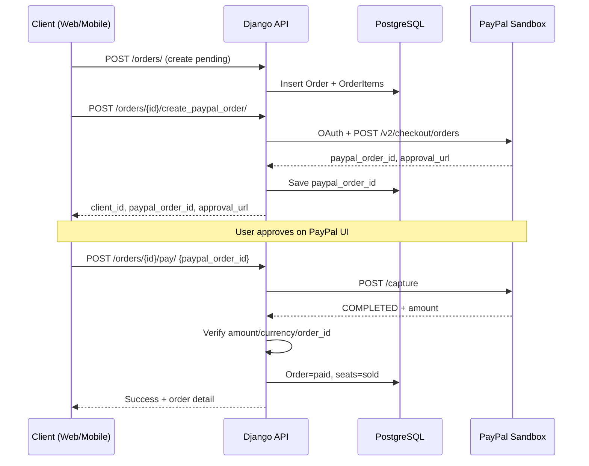

# PHÂN TÍCH THIẾT KẾ — USE CASE & ĐẶC TẢ UK

**Dự án:** DATN — Concert Booking System (ConcertGo)  
**Thành phần:** Backend (Django REST 6.0.4) · Web (React/Vite/Three.js) · Mobile (Android Kotlin)  
**Cập nhật:** 17/06/2026

---

# PHẦN 1: TOÀN BỘ USE CASE

## 1. Tổng quan

Hệ thống cho phép **fan** tìm concert → xem chi tiết / VR → chọn ghế → thanh toán PayPal Sandbox → quản lý vé; **organizer** tạo và vận hành show; **admin** duyệt organizer/concert và quản trị platform.

### 1.1. Tác nhân (Actors)

| Tác nhân | Mô tả |
|----------|--------|
| **Khách (Guest)** | Chưa đăng nhập. Web: duyệt concert, gợi ý, xem VR. Mobile: đặt vé yêu cầu login. |
| **Người dùng (User / Fan)** | JWT. Đặt vé, PayPal, yêu thích, hồ sơ, hủy đơn. |
| **Nhà tổ chức (Organizer)** | `role=organizer`, `OrganizerProfile` phải `approved`. Portal `/organizer/*`. |
| **Quản trị viên (Admin)** | `role=admin` hoặc `is_staff`. Portal `/admin/*` + Django Admin. |

**Quan hệ kế thừa (UML):** Organizer và Admin **generalization** User.

### 1.2. Phạm vi

**Trong phạm vi:** đăng ký/đăng nhập (fan + organizer), duyệt concert, VR preview, yêu thích, chọn ghế, giữ chỗ, checkout, **PayPal Sandbox**, xem/hủy đơn, gợi ý, organizer portal, admin portal web, CRUD master data.

**Ngoài phạm vi:** thanh toán production (MoMo/VNPAY thật), push notification, iOS, Near Me/Notifications mobile (placeholder).

---

## 2. Danh sách use case

### Nhóm A — Xác thực & tài khoản (UC-AUTH)

| ID | Use case | Actor | Mô tả |
|----|----------|-------|--------|
| UC01 | Đăng ký tài khoản fan | Guest | Email, mật khẩu, họ tên |
| UC01b | Đăng ký organizer | Guest | + company_name, business_license → profile `pending` |
| UC02 | Đăng nhập | Guest | JWT access + refresh |
| UC03 | Đăng xuất | User | Xóa token client |
| UC04 | Cập nhật hồ sơ | User | full_name, avatar_url |
| UC04b | Làm mới token | User | `POST /api/token/refresh/` |

**Giao diện:** Web `/login`, `/register`, `/profile` · Mobile: LoginActivity, RegisterActivity

### Nhóm B — Duyệt & khám phá (UC-CON)

| ID | Use case | Actor | Mô tả |
|----|----------|-------|--------|
| UC05 | Xem danh sách concert | Guest, User | search, genre, city, date |
| UC06 | Xem chi tiết concert | Guest, User | Nghệ sĩ, venue, banner |
| UC07 | Xem sơ đồ ghế | User | Seatmap 2D theo zone |
| UC08 | Xem gợi ý | Guest, User | Cá nhân hóa nếu login |
| UC08b | Xem VR preview venue | User | Three.js scene 3D |
| UC08c | Xem artists/venues | Guest, User | API list |

**Giao diện:** Web `/`, `/concerts/:id`, `/concerts/:id/vr-preview` · Mobile: Home, ConcertDetail

### Nhóm C — Đặt vé & thanh toán (UC-BOOK)

| ID | Use case | Actor | Mô tả |
|----|----------|-------|--------|
| UC09 | Chọn ghế | User | Tối đa 6 ghế (rule client) |
| UC10 | Giữ ghế (Reserve) | User | `reserved`, TTL 10 phút |
| UC11 | Áp dụng voucher | User | Validate mã giảm giá |
| UC12 | Tạo đơn hàng | User | `status=pending` |
| UC13 | Thanh toán PayPal Sandbox | User | create_paypal_order → capture → `paid` |
| UC14 | Xem vé của tôi | User | Lịch sử đơn |
| UC15 | Hủy đơn | User | pending → cancelled, trả ghế |

**Luồng chính:**

```
Xem concert → Chọn ghế (≤6) → Reserve (10 phút) → Checkout + voucher
→ Tạo đơn pending → PayPal Sandbox → Capture → Xác nhận
```

**Giao diện:** Web `/concerts/:id/seats`, `/checkout` · Mobile: SeatSelection, Checkout, Confirmation

### Nhóm D — Yêu thích & hành vi (UC-FAV)

| ID | Use case | Actor | Mô tả |
|----|----------|-------|--------|
| UC16 | Thêm/xóa yêu thích | User | Favorite concert |
| UC17 | Xem danh sách yêu thích | User | |
| UC18 | Ghi hành vi | User | view, click, favorite |

### Nhóm E — Organizer (UC-ORG)

| ID | Use case | Actor | Mô tả |
|----|----------|-------|--------|
| UC-ORG01 | Chờ duyệt organizer | Organizer | `/organizer/pending` khi `pending` |
| UC-ORG02 | Dashboard organizer | Organizer | Thống kê tổng quan |
| UC-ORG03 | CRUD concert | Organizer | draft → submit → publish |
| UC-ORG04 | CRUD venue & zone | Organizer | Sinh ghế, seatmap |
| UC-ORG05 | Xem orders / tickets | Organizer | Theo concert của mình |
| UC-ORG06 | Thống kê doanh thu | Organizer | `/organizer/statistics` |

### Nhóm F — Admin (UC-ADM)

| ID | Use case | Actor | Mô tả |
|----|----------|-------|--------|
| UC-ADM01 | Duyệt/từ chối organizer | Admin | approve / reject profile |
| UC-ADM02 | Duyệt/từ chối concert | Admin | pending_review workflow |
| UC-ADM03 | Quản lý users | Admin | `/admin/users` |
| UC-ADM04 | Quản lý vouchers | Admin | `/admin/vouchers` |
| UC-ADM05 | Quản lý venues/artists/concerts | Admin | CRUD API + Django Admin |
| UC-ADM06 | Báo cáo platform | Admin | `/admin/reports` |
| UC-ADM07 | Sinh ghế / zone | Admin | generate-seats, GLTF import |

---

## 3. Quy tắc nghiệp vụ

### 3.1. Công thức tính giá

```
Tổng = Tiền ghế + Phí đặt chỗ + Phí giao vé + Bảo hiểm − Giảm voucher
```

| Khoản mục | Giá trị |
|-----------|---------|
| Phí đặt chỗ | 20.000 ₫ / đơn |
| Vé giấy (`paper`) | +30.000 ₫ |
| Bảo hiểm | +50.000 ₫ × số ghế |
| Voucher | `%` trên `seat_subtotal` |
| PayPal | VND quy đổi USD (`PAYPAL_VND_PER_USD=25000`) |

### 3.2. Trạng thái ghế

```
available → reserved (TTL 10 phút) → sold (PayPal OK)
reserved → available (hết hạn / hủy đơn / release)
```

### 3.3. Trạng thái đơn hàng

| Trạng thái | Ý nghĩa |
|------------|---------|
| `pending` | Đã tạo, chưa thanh toán PayPal |
| `paid` | Capture PayPal thành công, ghế `sold` |
| `cancelled` | Đã hủy |

### 3.4. Workflow concert

```
draft → pending_review → approved → published
                      ↘ rejected → (sửa) → draft
```

---

## 4. Ánh xạ Use case ↔ Giao diện ↔ API

| Use case | Web (FE) | Mobile | API chính |
|----------|----------|--------|-----------|
| UC01–UC02 | `/register`, `/login` | Login, Register | `/auth/register`, `/auth/login` |
| UC05–UC06 | `/`, `/concerts/:id` | Home, Detail | `GET /api/concerts/concerts/` |
| UC07–UC10 | `/concerts/:id/seats` | SeatSelection | seatmap, reserve |
| UC11–UC13 | `/checkout`, PayPal buttons | CheckoutFragment | validate, create, create_paypal_order, pay |
| UC14–UC15 | `/tickets` | Dashboard | me/orders, cancel |
| UC08b | `/concerts/:id/vr-preview` | — | seatmap + GLB |
| UC-ORG | `/organizer/*` | — | `/api/organizer/*` |
| UC-ADM | `/admin/*` | — | `/api/admin/*` |

---

## 5. Khác biệt Web vs Mobile

| Hành vi | Web | Mobile |
|---------|-----|--------|
| Duyệt concert khi chưa login | ✅ | ✅ (Home) |
| PayPal | JS SDK embedded | Mở `approval_url` browser + nút Xác nhận |
| VR preview | ✅ Three.js | ❌ |
| Organizer / Admin portal | ✅ | ❌ |
| API backend | Cùng REST `/api/*` | Cùng REST |

---

## 6. Tóm tắt số lượng

- **~35 use case** (21 fan + bổ sung + organizer + admin)
- **4 actor:** Guest, User, Organizer, Admin
- **7 nhóm nghiệp vụ:** Auth, Concert, Booking, Favorites, Organizer, Admin, VR

---

# PHẦN 2: ĐẶC TẢ USE CASE (UK)

> Mỗi use case gồm: Mô tả · Tác nhân · Kích hoạt · Tiền điều kiện · Hậu điều kiện · Luồng chính · Luồng thay thế.  
> Luồng được mô tả bằng ngôn ngữ nghiệp vụ — không đi sâu tên API, tên bảng hay cấu trúc dữ liệu kỹ thuật.

---

## UC-01: Đăng ký tài khoản fan

**Mô tả:** Khách truy cập tạo tài khoản mới bằng email để sau này đăng nhập và đặt vé.

**Tác nhân:** Khách (chưa đăng nhập)

**Kích hoạt:** Khách chọn "Đăng ký" trên web hoặc ứng dụng mobile.

**Tiền điều kiện:** Email chưa được sử dụng; thiết bị có kết nối mạng.

**Hậu điều kiện:** Tài khoản fan mới được tạo; khách có thể chuyển sang màn hình đăng nhập.

**Luồng chính:**
1. Khách nhập email, mật khẩu, xác nhận mật khẩu và họ tên.
2. Khách nhấn "Đăng ký".
3. Hệ thống kiểm tra thông tin hợp lệ và lưu tài khoản mới.
4. Hệ thống thông báo đăng ký thành công và chuyển khách sang màn hình đăng nhập.

**Luồng thay thế:**
1. Email đã tồn tại hoặc dữ liệu không hợp lệ: hệ thống báo lỗi, giữ nguyên nội dung form để khách sửa.
2. Hai lần nhập mật khẩu không khớp: hệ thống yêu cầu nhập lại trước khi gửi đăng ký.

---

## UC-01b: Đăng ký tài khoản nhà tổ chức

**Mô tả:** Khách đăng ký với tư cách nhà tổ chức sự kiện, kèm thông tin doanh nghiệp để chờ quản trị viên duyệt.

**Tác nhân:** Khách

**Kích hoạt:** Khách chọn đăng ký và đánh dấu "Đăng ký làm nhà tổ chức".

**Tiền điều kiện:** Email chưa được sử dụng.

**Hậu điều kiện:** Tài khoản được tạo ở trạng thái chờ duyệt; nhà tổ chức chưa thể quản lý concert cho đến khi được phê duyệt.

**Luồng chính:**
1. Khách nhập thông tin cá nhân và thông tin doanh nghiệp (tên công ty, giấy phép kinh doanh, số điện thoại liên hệ).
2. Khách gửi đơn đăng ký.
3. Hệ thống lưu hồ sơ nhà tổ chức ở trạng thái "chờ duyệt".
4. Sau khi đăng nhập, nhà tổ chức được chuyển tới trang thông báo đang chờ admin xét duyệt.

**Luồng thay thế:**
1. Thiếu thông tin bắt buộc: hệ thống báo lỗi và yêu cầu bổ sung.

---

## UC-02: Đăng nhập

**Mô tả:** Người dùng xác thực danh tính bằng email và mật khẩu để sử dụng các chức năng yêu cầu đăng nhập.

**Tác nhân:** Khách

**Kích hoạt:** Khách chọn "Đăng nhập", hoặc bị chuyển hướng khi truy cập chức năng cần xác thực.

**Tiền điều kiện:** Tài khoản đã tồn tại trong hệ thống.

**Hậu điều kiện:** Người dùng được coi là đã đăng nhập; có thể đặt vé, quản lý hồ sơ hoặc vào khu vực quản trị tùy vai trò.

**Luồng chính:**
1. Người dùng nhập email và mật khẩu.
2. Người dùng nhấn "Đăng nhập".
3. Hệ thống xác minh thông tin đăng nhập.
4. Hệ thống cấp phiên đăng nhập và chuyển người dùng về trang phù hợp: fan về trang chủ, nhà tổ chức vào khu quản lý, admin vào khu quản trị.

**Luồng thay thế:**
1. Sai email hoặc mật khẩu: hệ thống báo lỗi, người dùng nhập lại.
2. Phiên đăng nhập hết hạn sau một thời gian: người dùng đăng nhập lại hoặc hệ thống tự làm mới phiên nếu còn hạn gia hạn.

---

## UC-03: Đăng xuất

**Mô tả:** Người dùng kết thúc phiên làm việc trên thiết bị hiện tại.

**Tác nhân:** Người dùng đã đăng nhập

**Kích hoạt:** Người dùng chọn "Đăng xuất" trên menu hoặc trang cá nhân.

**Tiền điều kiện:** Người dùng đang ở trạng thái đã đăng nhập.

**Hậu điều kiện:** Phiên đăng nhập trên thiết bị bị xóa; người dùng không truy cập được các chức năng bảo vệ cho đến khi đăng nhập lại.

**Luồng chính:**
1. Người dùng chọn đăng xuất.
2. Hệ thống xóa thông tin phiên trên thiết bị.
3. Giao diện chuyển về trang chủ hoặc trang đăng nhập.

---

## UC-04: Cập nhật hồ sơ

**Mô tả:** Người dùng xem và chỉnh sửa thông tin cá nhân hiển thị trên hệ thống.

**Tác nhân:** Người dùng đã đăng nhập

**Kích hoạt:** Người dùng mở trang "Hồ sơ" hoặc "Chỉnh sửa hồ sơ".

**Tiền điều kiện:** Đã đăng nhập.

**Hậu điều kiện:** Thông tin hồ sơ được cập nhật và hiển thị ở các màn hình liên quan.

**Luồng chính:**
1. Người dùng mở trang hồ sơ; hệ thống hiển thị thông tin hiện tại.
2. Người dùng sửa họ tên hoặc ảnh đại diện.
3. Người dùng nhấn "Lưu".
4. Hệ thống lưu thay đổi và thông báo thành công.

**Luồng thay thế:**
1. Dữ liệu không hợp lệ: hệ thống báo lỗi, không lưu.

---

## UC-05: Xem danh sách concert

**Mô tả:** Người dùng duyệt danh sách các buổi concert, có thể tìm kiếm và lọc theo nhu cầu.

**Tác nhân:** Khách, Người dùng

**Kích hoạt:** Mở trang chủ hoặc màn hình "Trang chủ" trên mobile.

**Tiền điều kiện:** Hệ thống có dữ liệu concert (hoặc hiển thị trạng thái trống).

**Hậu điều kiện:** Danh sách concert được hiển thị theo bộ lọc người dùng chọn.

**Luồng chính:**
1. Người dùng mở trang chủ.
2. Hệ thống tải danh sách các concert đang mở bán.
3. Người dùng có thể tìm theo tên, lọc theo thể loại, thành phố hoặc ngày diễn.
4. Hệ thống cập nhật danh sách theo tiêu chí lọc.
5. (Tuỳ chọn) Hệ thống hiển thị thêm mục "Gợi ý cho bạn" nếu người dùng đã đăng nhập.

**Luồng thay thế:**
1. Không có kết quả phù hợp: hiển thị thông báo "Không tìm thấy concert".
2. Lỗi kết nối: hiển thị thông báo lỗi và nút thử lại.

---

## UC-06: Xem chi tiết concert

**Mô tả:** Người dùng xem đầy đủ thông tin một buổi concert trước khi quyết định đặt vé.

**Tác nhân:** Khách, Người dùng

**Kích hoạt:** Chọn một concert từ danh sách hoặc từ mục gợi ý.

**Tiền điều kiện:** Concert tồn tại và đang được phép hiển thị.

**Hậu điều kiện:** Thông tin concert, nghệ sĩ và địa điểm được hiển thị; người dùng đã đăng nhập có thể chọn ghế hoặc thêm yêu thích.

**Luồng chính:**
1. Người dùng chọn một concert.
2. Hệ thống hiển thị tiêu đề, mô tả, thời gian, banner, danh sách nghệ sĩ và thông tin địa điểm.
3. Nếu đã đăng nhập, hệ thống ghi nhận người dùng đã xem concert này (phục vụ gợi ý sau này).
4. Người dùng có thể chọn "Chọn ghế", "Xem trước 3D" hoặc "Thêm yêu thích".

**Luồng thay thế:**
1. Concert không tồn tại hoặc đã gỡ: hiển thị thông báo lỗi hoặc quay về danh sách.
2. Chưa đăng nhập mà chọn đặt vé trên mobile: chuyển sang màn hình đăng nhập.

---

## UC-07: Xem sơ đồ ghế

**Mô tả:** Người dùng xem bản đồ ghế theo từng khu vực, giá vé và trạng thái từng ghế trước khi chọn.

**Tác nhân:** Người dùng đã đăng nhập

**Kích hoạt:** Chọn "Chọn ghế" từ trang chi tiết concert.

**Tiền điều kiện:** Đã đăng nhập; concert đã có sơ đồ ghế được thiết lập.

**Hậu điều kiện:** Sơ đồ ghế hiển thị với trạng thái còn trống, đang giữ hoặc đã bán.

**Luồng chính:**
1. Người dùng vào màn hình chọn ghế.
2. Hệ thống hiển thị sơ đồ chia theo khu (VIP, A, B…), mỗi khu có màu và mức giá riêng.
3. Ghế đã bán hoặc đang được người khác giữ sẽ không cho chọn.
4. Người dùng chọn các ghế còn trống (tối đa 6 ghế mỗi lần).

**Luồng thay thế:**
1. Chưa đăng nhập: chuyển sang đăng nhập trước.
2. Concert chưa có ghế: hiển thị thông báo "Chưa có sơ đồ ghế cho buổi diễn này".

---

## UC-08: Xem gợi ý concert

**Mô tả:** Hệ thống đề xuất các concert có thể phù hợp với sở thích hoặc ngữ cảnh người dùng đang xem.

**Tác nhân:** Khách, Người dùng

**Kích hoạt:** Tải trang chủ hoặc xem chi tiết một concert.

**Tiền điều kiện:** Có dữ liệu concert trong hệ thống.

**Hậu điều kiện:** Danh sách gợi ý được hiển thị trên giao diện.

**Luồng chính:**
1. Hệ thống xác định ngữ cảnh: đang xem concert cụ thể hay đang ở trang chủ.
2. Nếu đang xem một concert: gợi ý các show cùng địa điểm hoặc cùng nghệ sĩ.
3. Nếu đã đăng nhập và có lịch sử xem: ưu tiên concert cùng thể loại người dùng quan tâm.
4. Nếu là khách hoặc chưa đủ dữ liệu: gợi ý các concert sắp diễn gần nhất.
5. Giao diện hiển thị mục "Gợi ý cho bạn".

**Luồng thay thế:**
1. Không tìm được gợi ý phù hợp: hiển thị danh sách concert phổ biến hoặc để trống.

---

## UC-08b: Xem trước địa điểm 3D (VR Preview)

**Mô tả:** Người dùng quan sát mô hình không gian nhà hát/sân khấu ở dạng 3D để hình dung vị trí ghế trước khi mua vé.

**Tác nhân:** Người dùng

**Kích hoạt:** Chọn "Xem trước 3D" / "VR Preview" trên trang chi tiết concert (web).

**Tiền điều kiện:** Địa điểm của concert có mô hình 3D; người dùng dùng trình duyệt hỗ trợ đồ họa 3D.

**Hậu điều kiện:** Người dùng đã quan sát được không gian venue; có thể chuyển sang chọn ghế.

**Luồng chính:**
1. Người dùng mở trang xem trước 3D.
2. Hệ thống tải mô hình địa điểm và vị trí các ghế lên sân khấu ảo.
3. Người dùng xoay, phóng to/thu nhỏ để quan sát từng khu ghế.
4. (Tuỳ chọn) Người dùng chọn ghế trực tiếp trên mô hình 3D rồi chuyển sang bước đặt vé.

---

## UC-09: Chọn ghế

**Mô tả:** Người dùng lựa chọn các ghế muốn mua trên sơ đồ.

**Tác nhân:** Người dùng đã đăng nhập

**Kích hoạt:** Nhấn/chạm vào ghế còn trống trên sơ đồ.

**Tiền điều kiện:** Sơ đồ ghế đã được tải; ghế ở trạng thái có thể chọn.

**Hậu điều kiện:** Danh sách ghế đã chọn và tổng tiền tạm tính được hiển thị.

**Luồng chính:**
1. Người dùng chọn từng ghế còn trống trên sơ đồ.
2. Giao diện đánh dấu ghế đã chọn và cập nhật tổng tiền tạm tính theo giá từng khu.
3. Khi đã chọn đủ, người dùng nhấn "Tiếp tục" để sang bước giữ chỗ.

**Luồng thay thế:**
1. Chọn quá 6 ghế: hệ thống cảnh báo và không cho thêm.
2. Chọn ghế đã bán hoặc đang giữ: ghế không phản hồi hoặc hiện thông báo không còn trống.

---

## UC-10: Giữ ghế tạm thời

**Mô tả:** Hệ thống tạm khóa các ghế người dùng đã chọn trong một khoảng thời gian nhất định để họ hoàn tất thanh toán mà không bị người khác tranh mất.

**Tác nhân:** Người dùng đã đăng nhập

**Kích hoạt:** Người dùng xác nhận danh sách ghế và chuyển sang bước thanh toán.

**Tiền điều kiện:** Đã chọn ít nhất một ghế còn trống; chưa vượt quá giới hạn 6 ghế.

**Hậu điều kiện:** Các ghế được giữ riêng cho người dùng trong **10 phút**; người dùng được phép tiếp tục checkout trong thời hạn này.

**Luồng chính:**
1. Người dùng hoàn tất chọn ghế và nhấn tiếp tục.
2. Hệ thống kiểm tra các ghế vẫn còn trống tại thời điểm xác nhận.
3. Hệ thống đánh dấu các ghế này là "đang giữ" cho người dùng, kèm thời điểm hết hạn giữ chỗ.
4. Giao diện chuyển sang trang thanh toán và hiển thị đồng hồ đếm ngược thời gian còn lại.

**Luồng thay thế:**
1. Một hoặc nhiều ghế vừa bị người khác giữ hoặc mua trước: hệ thống báo lỗi, yêu cầu người dùng chọn lại ghế khác.
2. Hết 10 phút mà chưa thanh toán: ghế tự trở lại trạng thái trống; người dùng phải chọn ghế lại từ đầu.

---

## UC-11: Áp dụng mã giảm giá

**Mô tả:** Người dùng nhập mã voucher để được giảm một phần tiền vé trước khi thanh toán.

**Tác nhân:** Người dùng đã đăng nhập

**Kích hoạt:** Nhập mã trên trang thanh toán và nhấn "Áp dụng".

**Tiền điều kiện:** Đã giữ ghế và đang ở bước checkout; đã có tổng tiền ghế tạm tính.

**Hậu điều kiện:** Nếu mã hợp lệ, tổng thanh toán được giảm tương ứng; nếu không hợp lệ, tổng tiền giữ nguyên.

**Luồng chính:**
1. Người dùng nhập mã giảm giá.
2. Người dùng nhấn "Áp dụng".
3. Hệ thống kiểm tra mã còn hiệu lực hay không.
4. Nếu hợp lệ, hệ thống tính số tiền được giảm theo phần trăm quy định và cập nhật bảng chi tiết giá trên màn hình.
5. Người dùng thấy dòng "Ưu đãi voucher" và tổng cộng mới.

**Luồng thay thế:**
1. Mã không tồn tại hoặc đã hết hạn: hiển thị thông báo lỗi, không áp dụng giảm giá.
2. Người dùng xóa mã: hệ thống tính lại tổng tiền ban đầu.

---

## UC-12: Tạo đơn đặt vé

**Mô tả:** Hệ thống lập đơn hàng chính thức từ các ghế đang được giữ, kèm các lựa chọn giao vé và bảo hiểm.

**Tác nhân:** Người dùng đã đăng nhập

**Kích hoạt:** Người dùng hoàn tất cấu hình checkout và bắt đầu thanh toán.

**Tiền điều kiện:** Ghế vẫn đang được giữ cho người dùng và chưa hết thời hạn 10 phút.

**Hậu điều kiện:** Đơn hàng được tạo ở trạng thái "chờ thanh toán"; chi tiết từng ghế và khoản phí được lưu lại.

**Luồng chính:**
1. Người dùng chọn hình thức nhận vé (vé điện tử hoặc vé giấy), có mua bảo hiểm hay không, và xem lại bảng chi tiết giá.
2. Người dùng nhấn bắt đầu thanh toán.
3. Hệ thống xác nhận ghế vẫn còn được giữ cho người dùng này.
4. Hệ thống tính đầy đủ các khoản: tiền ghế, phí đặt chỗ, phí giao vé (nếu có), phí bảo hiểm (nếu có), trừ ưu đãi voucher (nếu có).
5. Hệ thống tạo đơn hàng mới ở trạng thái chờ thanh toán.
6. Giao diện chuyển sang bước thanh toán PayPal.

**Luồng thay thế:**
1. Ghế đã hết hạn giữ: hệ thống báo lỗi, yêu cầu quay lại chọn ghế.
2. Mã voucher không còn hợp lệ tại thời điểm tạo đơn: hệ thống từ chối hoặc bỏ giảm giá, thông báo cho người dùng.

---

## UC-13: Thanh toán qua PayPal Sandbox

**Mô tả:** Người dùng hoàn tất thanh toán đơn hàng qua cổng PayPal môi trường thử nghiệm (không trừ tiền thật).

**Tác nhân:** Người dùng đã đăng nhập

**Kích hoạt:** Sau khi đơn hàng được tạo, người dùng xác nhận thanh toán qua PayPal.

**Tiền điều kiện:** Đơn hàng đang chờ thanh toán; hệ thống đã cấu hình sẵn tài khoản PayPal thử nghiệm.

**Hậu điều kiện:** Đơn hàng chuyển sang "đã thanh toán"; các ghế chuyển sang "đã bán"; người dùng thấy màn hình xác nhận đặt vé thành công.

**Luồng chính:**
1. Hệ thống kiểm tra cổng PayPal đã sẵn sàng.
2. Hệ thống khởi tạo phiên thanh toán PayPal cho đơn hàng vừa tạo.
3. **Trên web:** người dùng thấy nút PayPal, đăng nhập tài khoản test và xác nhận thanh toán ngay trên trang.
4. **Trên mobile:** hệ thống mở trình duyệt PayPal; sau khi thanh toán xong, người dùng quay lại app và nhấn "Xác nhận".
5. Hệ thống xác minh khoản thanh toán từ PayPal khớp với số tiền đơn hàng.
6. Hệ thống cập nhật đơn thành công và khóa các ghế là đã bán.
7. Người dùng được chuyển tới trang xác nhận / vé của tôi.

**Luồng thay thế:**
1. PayPal chưa được cấu hình trên server: thông báo quản trị viên cần thiết lập trước khi thanh toán.
2. Máy chủ không kết nối được PayPal (lỗi mạng): thông báo thử lại sau hoặc kiểm tra kết nối internet của máy chạy backend.
3. Người dùng hủy trên trang PayPal: đơn vẫn chờ thanh toán, có thể thử lại hoặc hủy đơn.
4. Số tiền PayPal trả về không khớp đơn hàng: hệ thống từ chối xác nhận, không chuyển ghế sang đã bán.

---

## UC-14: Xem vé của tôi

**Mô tả:** Người dùng xem lại toàn bộ đơn đặt vé đã thực hiện.

**Tác nhân:** Người dùng đã đăng nhập

**Kích hoạt:** Mở "Vé của tôi" trên web hoặc tab Dashboard trên mobile.

**Tiền điều kiện:** Đã đăng nhập.

**Hậu điều kiện:** Danh sách đơn hàng được hiển thị theo thời gian mới nhất.

**Luồng chính:**
1. Người dùng mở trang vé của tôi.
2. Hệ thống tải danh sách các đơn đã đặt (tên concert, ngày, tổng tiền, trạng thái).
3. Với đơn đã thanh toán, người dùng có thể xem chi tiết hoặc mã vé demo.
4. Với đơn chờ thanh toán, người dùng có thể hủy đơn.

**Luồng thay thế:**
1. Chưa có đơn nào: hiển thị "Bạn chưa có vé nào".
2. Lỗi tải dữ liệu: thông báo lỗi và nút thử lại.

---

## UC-15: Hủy đơn hàng

**Mô tả:** Người dùng hủy một đơn chưa thanh toán; các ghế liên quan được trả lại cho người khác đặt.

**Tác nhân:** Người dùng đã đăng nhập

**Kích hoạt:** Chọn "Hủy đơn" trên đơn đang chờ thanh toán.

**Tiền điều kiện:** Đơn thuộc về người dùng hiện tại; đơn chưa thanh toán thành công.

**Hậu điều kiện:** Đơn chuyển sang trạng thái đã hủy; ghế trở lại trống.

**Luồng chính:**
1. Người dùng mở chi tiết đơn chờ thanh toán.
2. Người dùng chọn hủy và xác nhận.
3. Hệ thống hủy đơn và trả các ghế về trạng thái có thể đặt lại.
4. Giao diện cập nhật trạng thái đơn.

**Luồng thay thế:**
1. Người dùng không xác nhận hủy: thao tác bị huỷ, đơn giữ nguyên.
2. Đơn đã thanh toán: không cho hủy qua luồng này (cần liên hệ hỗ trợ).

---

## UC-16: Thêm / bỏ yêu thích concert

**Mô tả:** Người dùng đánh dấu hoặc bỏ đánh dấu concert yêu thích để xem lại sau.

**Tác nhân:** Người dùng đã đăng nhập

**Kích hoạt:** Nhấn biểu tượng trái tim trên trang chi tiết concert.

**Tiền điều kiện:** Đã đăng nhập; concert tồn tại.

**Hậu điều kiện:** Trạng thái yêu thích được cập nhật trên giao diện và trong danh sách yêu thích.

**Luồng chính (thêm):**
1. Người dùng nhấn "Thêm yêu thích".
2. Hệ thống lưu concert vào danh sách yêu thích của người dùng.
3. Biểu tượng trái tim chuyển sang trạng thái đã chọn.

**Luồng thay thế (bỏ):**
1. Người dùng nhấn lại khi đã yêu thích.
2. Hệ thống xóa concert khỏi danh sách yêu thích.
3. Biểu tượng trở về trạng thái chưa chọn.

---

## UC-17: Xem danh sách yêu thích

**Mô tả:** Người dùng xem tất cả concert đã đánh dấu yêu thích.

**Tác nhân:** Người dùng đã đăng nhập

**Kích hoạt:** Mở trang "Yêu thích" trên web hoặc tab Favorites trên mobile.

**Tiền điều kiện:** Đã đăng nhập.

**Hậu điều kiện:** Danh sách concert yêu thích được hiển thị.

**Luồng chính:**
1. Người dùng mở trang yêu thích.
2. Hệ thống tải danh sách concert đã lưu.
3. Người dùng có thể chọn một concert để xem chi tiết hoặc bỏ yêu thích.

**Luồng thay thế:**
1. Chưa có mục yêu thích nào: hiển thị trạng thái trống.

---

## UC-18: Ghi nhận hành vi người dùng

**Mô tả:** Hệ thống lưu lại các tương tác của người dùng với concert để cải thiện gợi ý.

**Tác nhân:** Người dùng đã đăng nhập

**Kích hoạt:** Xem chi tiết concert, nhấn vào concert, hoặc thêm yêu thích.

**Tiền điều kiện:** Đã đăng nhập.

**Hậu điều kiện:** Hành vi được ghi nhận phục vụ gợi ý sau này.

**Luồng chính:**
1. Người dùng thực hiện thao tác (xem, nhấn, yêu thích) trên một concert.
2. Hệ thống ghi nhận loại hành vi và thời điểm.
3. Dữ liệu được dùng khi tính gợi ý ở UC-08.

**Luồng thay thế:**
1. Khách chưa đăng nhập: không ghi hành vi cá nhân.

---

## UC-ORG01: Chờ duyệt tài khoản nhà tổ chức

**Mô tả:** Nhà tổ chức mới đăng ký theo dõi trạng thái hồ sơ cho đến khi được admin phê duyệt.

**Tác nhân:** Nhà tổ chức (chưa được duyệt)

**Kích hoạt:** Đăng nhập sau khi đăng ký organizer.

**Tiền điều kiện:** Hồ sơ ở trạng thái "chờ duyệt".

**Hậu điều kiện:** Nhà tổ chức biết rõ cần chờ hoặc đã được chuyển vào khu quản lý nếu được duyệt.

**Luồng chính:**
1. Nhà tổ chức đăng nhập.
2. Hệ thống nhận diện hồ sơ chưa duyệt và hiển thị trang chờ với thông báo trạng thái.
3. Nhà tổ chức không truy cập được các chức năng tạo concert cho đến khi được phê duyệt.

**Luồng thay thế:**
1. Hồ sơ bị từ chối: hiển thị lý do từ chối; nhà tổ chức liên hệ admin hoặc đăng ký lại.

---

## UC-ORG02: Xem tổng quan khu nhà tổ chức

**Mô tả:** Nhà tổ chức xem nhanh số liệu tổng hợp về concert và đơn hàng của mình.

**Tác nhân:** Nhà tổ chức (đã duyệt)

**Kích hoạt:** Mở trang Dashboard trong khu organizer.

**Luồng chính:**
1. Nhà tổ chức vào trang tổng quan.
2. Hệ thống hiển thị số concert đang/quản lý, số đơn, doanh thu tổng hợp.
3. Nhà tổ chức có thể điều hướng sang quản lý concert, đơn hàng hoặc thống kê chi tiết.

---

## UC-ORG03: Quản lý concert

**Mô tả:** Nhà tổ chức tạo, chỉnh sửa và đưa concert từ bản nháp lên trạng thái công khai sau khi được duyệt.

**Tác nhân:** Nhà tổ chức (đã duyệt)

**Kích hoạt:** Vào mục "Quản lý concert" trong khu organizer.

**Luồng chính:**
1. Nhà tổ chức tạo concert mới ở trạng thái bản nháp, nhập tiêu đề, mô tả, thời gian, địa điểm, nghệ sĩ.
2. Nhà tổ chức lưu và chỉnh sửa cho đến khi hoàn thiện.
3. Nhà tổ chức gửi concert để admin xét duyệt.
4. Sau khi admin duyệt, nhà tổ chức công bố concert.
5. Fan có thể thấy và đặt vé concert đã công bố.

**Luồng thay thế:**
1. Admin từ chối: concert trả về trạng thái bị từ chối; nhà tổ chức sửa và gửi lại.

---

## UC-ORG04: Quản lý địa điểm và sơ đồ ghế

**Mô tả:** Nhà tổ chức thiết lập venue, các khu ghế, giá và sinh sơ đồ ghế cho buổi diễn.

**Tác nhân:** Nhà tổ chức (đã duyệt)

**Luồng chính:**
1. Nhà tổ chức tạo hoặc chọn địa điểm tổ chức.
2. Nhà tổ chức định nghĩa các khu ghế (tên, giá, màu hiển thị).
3. Hệ thống sinh ghế theo lưới hoặc nhập từ mô hình 3D venue.
4. Nhà tổ chức xem trước sơ đồ ghế trước khi mở bán.

---

## UC-ORG05: Xem đơn hàng và tình trạng vé

**Mô tả:** Nhà tổ chức theo dõi đơn đặt vé và số lượng vé đã bán theo từng concert.

**Tác nhân:** Nhà tổ chức (đã duyệt)

**Luồng chính:**
1. Nhà tổ chức chọn concert cần theo dõi.
2. Hệ thống hiển thị danh sách đơn hàng hoặc thống kê vé đã bán theo từng khu ghế.
3. Nhà tổ chức dùng số liệu để đánh giá tình hình bán vé.

---

## UC-ORG06: Xem thống kê doanh thu

**Mô tả:** Nhà tổ chức xem báo cáo doanh thu theo thời gian và theo từng concert.

**Tác nhân:** Nhà tổ chức (đã duyệt)

**Luồng chính:**
1. Nhà tổ chức mở trang thống kê.
2. Hệ thống tổng hợp doanh thu từ các đơn đã thanh toán.
3. Nhà tổ chức xem biểu đồ hoặc bảng số liệu theo concert.

---

## UC-ADM01: Duyệt / từ chối nhà tổ chức

**Mô tả:** Quản trị viên xem xét hồ sơ đăng ký nhà tổ chức và quyết định cho phép hoặc từ chối.

**Tác nhân:** Quản trị viên

**Luồng chính:**
1. Admin mở danh sách nhà tổ chức chờ duyệt.
2. Admin xem thông tin công ty và giấy phép.
3. Admin chọn "Duyệt" hoặc "Từ chối" (kèm lý do nếu từ chối).
4. Hệ thống cập nhật trạng thái hồ sơ; nhà tổ chức được duyệt có thể vào khu quản lý.

---

## UC-ADM02: Duyệt / từ chối concert

**Mô tả:** Quản trị viên kiểm duyệt concert do nhà tổ chức gửi lên trước khi được công bố.

**Tác nhân:** Quản trị viên

**Luồng chính:**
1. Admin mở danh sách concert chờ duyệt.
2. Admin xem nội dung, thời gian, địa điểm của concert.
3. Admin duyệt hoặc từ chối kèm ghi chú.
4. Concert được duyệt có thể được nhà tổ chức hoặc admin công bố cho fan.

---

## UC-ADM03 đến UC-ADM07: Quản trị platform

| ID | Mô tả ngắn | Luồng chính |
|----|------------|-------------|
| UC-ADM03 | Quản lý người dùng | Admin xem, lọc, vô hiệu hoá hoặc đổi vai trò tài khoản |
| UC-ADM04 | Quản lý voucher | Admin tạo/sửa mã giảm giá, bật/tắt hiệu lực |
| UC-ADM05 | Quản lý dữ liệu master | Admin CRUD nghệ sĩ, địa điểm, concert qua portal hoặc Django Admin |
| UC-ADM06 | Báo cáo platform | Admin xem tổng user, đơn, doanh thu toàn hệ thống |
| UC-ADM07 | Thiết lập ghế | Admin tạo khu ghế, sinh ghế lưới hoặc import từ mô hình 3D venue |

---

# PHẦN 3: SEQUENCE — THANH TOÁN PAYPAL



---

# PHẦN 4: API ENDPOINTS TỔNG HỢP

| Prefix | Mô tả |
|--------|--------|
| `/api/users/` | Auth, me, favorites, orders |
| `/api/artists/` | Artists CRUD |
| `/api/venues/` | Venues CRUD |
| `/api/concerts/` | Concerts, seatmap, artists, venue |
| `/api/seats/` | Zones, seats, reserve, release |
| `/api/orders/` | Orders, vouchers, payment-config, PayPal |
| `/api/behaviors/` | Behaviors, recommend |
| `/api/organizer/` | Organizer portal |
| `/api/admin/` | Admin portal |
| `/api/token/refresh/` | JWT refresh |
| `/api/docs/` | Swagger UI |

---

## Tài liệu tham chiếu

- Phân tích thiết kế: `docs/PHAN_TICH_THIET_KE.md`
- Cơ sở dữ liệu: `docs/CO_SO_DU_LIEU.md`
- Pricing: `be/app/orders/pricing.py`
- PayPal: `be/app/orders/payments.py`
- Web routes: `FE/src/App.tsx`
